<div align="center">
  <h1>Wandroid Pro</h1>
  <p>一个把 WanAndroid 阅读、知识管理、待办笔记与 AI 助手整合到一起的 Flutter 客户端。</p>
  <p>
    <a href="#项目简介">项目简介</a> •
    <a href="#功能概览">功能概览</a> •
    <a href="#使用场景">使用场景</a> •
    <a href="#界面预览">界面预览</a> •
    <a href="#技术栈">技术栈</a> •
    <a href="#快速开始">快速开始</a> •
    <a href="#项目结构">项目结构</a> •
    <a href="#架构摘要">架构摘要</a>
  </p>
</div>

---

## 项目简介

`Wandroid Pro` 不是单纯的 WanAndroid 阅读器，而是围绕「技术内容消费 + 个人知识沉淀 + AI 辅助学习」扩展出来的一体化应用。

应用当前以 `lib/main.dart` 为入口，主导航位于 `lib/pages/homepage/main_page.dart`，提供 6 个核心 Tab：

- 首页文章流
- 知识体系
- AI 对话
- 导航与问答
- 公众号文章
- 项目广场

在此基础上，侧边栏继续扩展出 TODO、番茄钟、笔记、阅读统计、浏览历史、AI 日报、AI 周报、AI 配置、聊天记录等能力，让阅读行为可以进一步转化为计划、记录与总结。

仓库地址：[xoliu1/Wandroid-Pro](https://github.com/xoliu1/Wandroid-Pro)

---

## 界面预览

### 产品首页展示

<table>
  <tr>
    <td align="center" width="33%">
      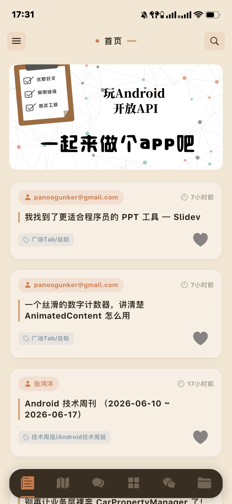
      <br />
      <sub>首页信息流：从技术内容消费开始，串起整套阅读入口。</sub>
    </td>
    <td align="center" width="33%">
      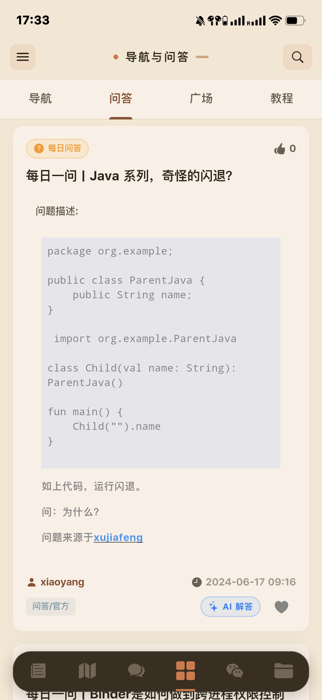
      <br />
      <sub>AI 对话主页：把学习总结、路线规划和问题分析直接做成入口。</sub>
    </td>
    <td align="center" width="33%">
      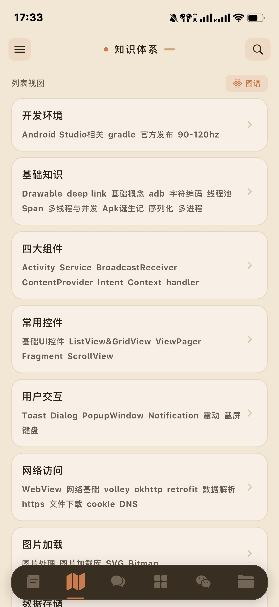
      <br />
      <sub>知识体系：按主题组织 Android 知识点，并保留图谱化扩展空间。</sub>
    </td>
  </tr>
  <tr>
    <td align="center" width="33%">
      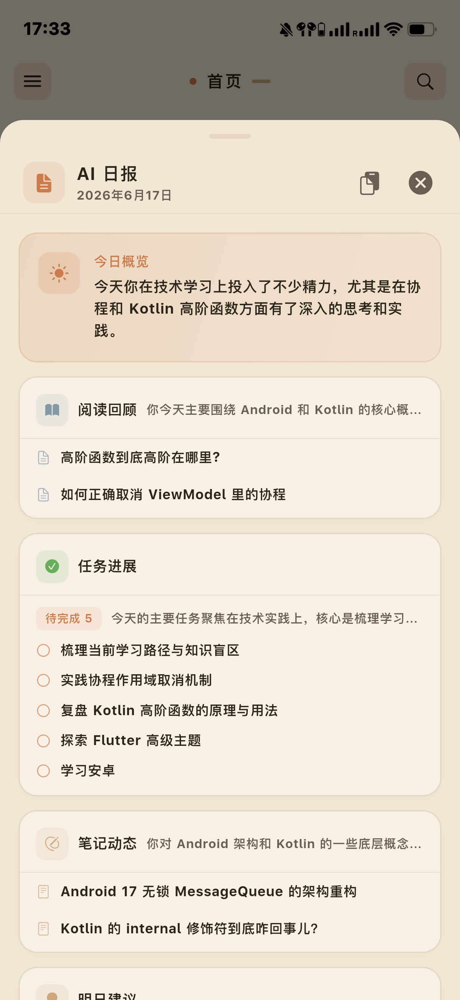
      <br />
      <sub>AI 日报：把当天阅读、任务和笔记自动收束成一次轻量复盘。</sub>
    </td>
    <td align="center" width="33%">
      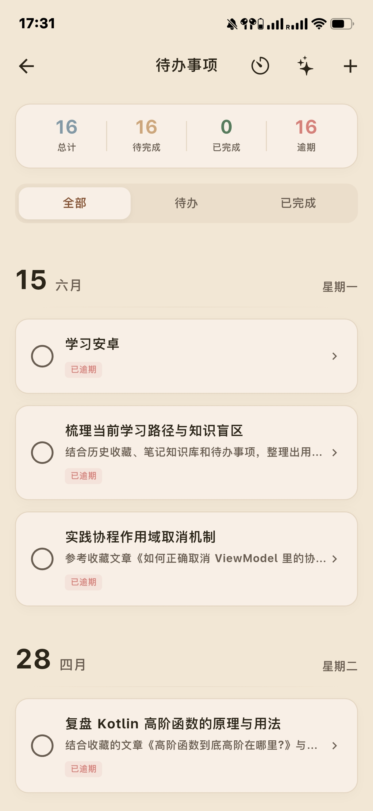
      <br />
      <sub>待办事项：把学习目标进一步落成任务列表和执行状态。</sub>
    </td>
    <td align="center" width="33%">
      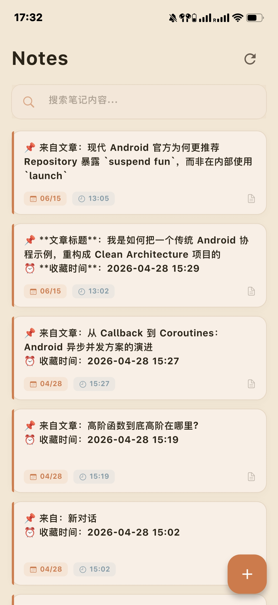
      <br />
      <sub>笔记系统：沉淀文章摘要、个人理解与 AI 生成内容。</sub>
    </td>
  </tr>
</table>


### 内容浏览与知识发现

<table>
  <tr>
    <td align="center" width="33%">
      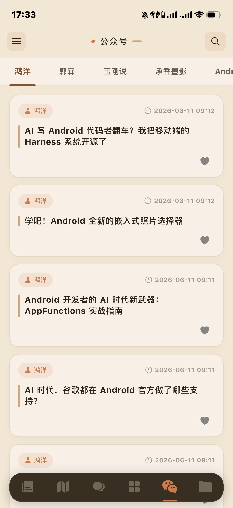
      <br />
      <sub>导航与问答：每日一问结合 AI 解答，直接连接阅读和思考。</sub>
    </td>
    <td align="center" width="33%">
      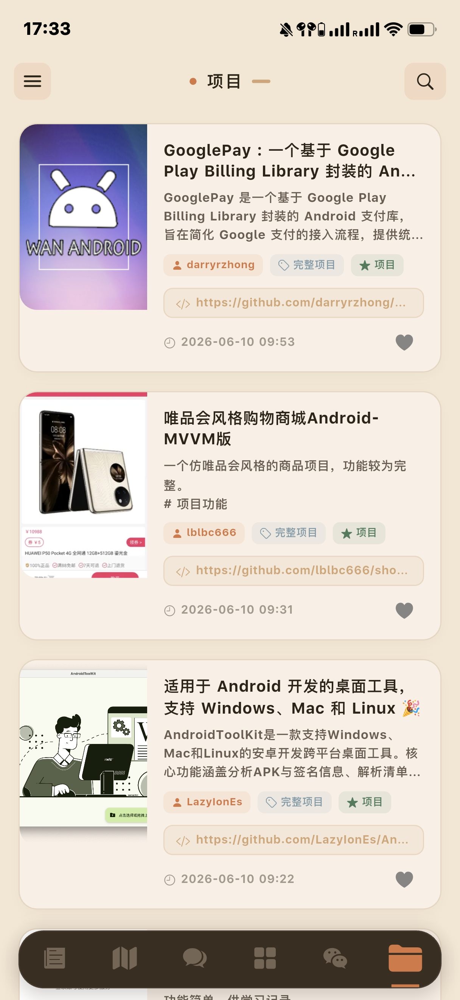
      <br />
      <sub>公众号阅读：按号浏览技术内容，延续 WanAndroid 阅读链路。</sub>
    </td>
    <td align="center" width="33%">
      
      <br />
      <sub>项目广场：浏览开源项目、项目简介与外链信息。</sub>
    </td>
  </tr>
  <tr>
    <td align="center" width="33%">
      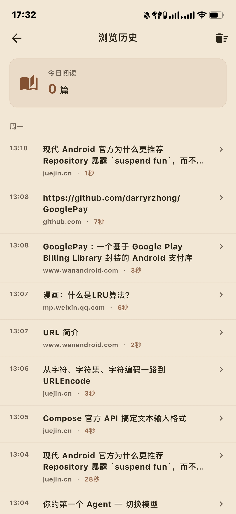
      <br />
      <sub>浏览历史：记录阅读轨迹，为复盘与个性化推荐提供素材。</sub>
    </td>
    <td align="center" width="33%">
      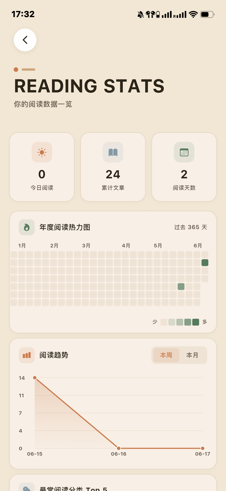
      <br />
      <sub>阅读统计：用热力图和趋势图观察长期阅读习惯。</sub>
    </td>
    <td align="center" width="33%">
      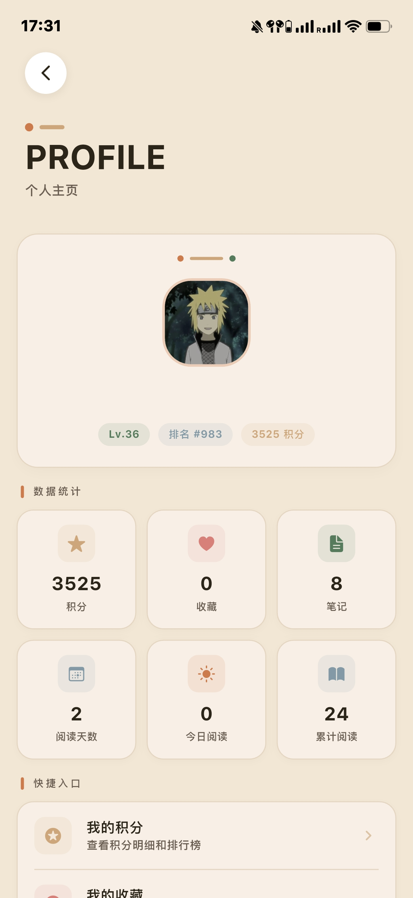
      <br />
      <sub>个人面板：把积分、收藏、笔记与阅读数据集中到一个入口。</sub>
    </td>
  </tr>
</table>


### AI 助手与学习复盘

<table>
  <tr>
    <td align="center" width="33%">
      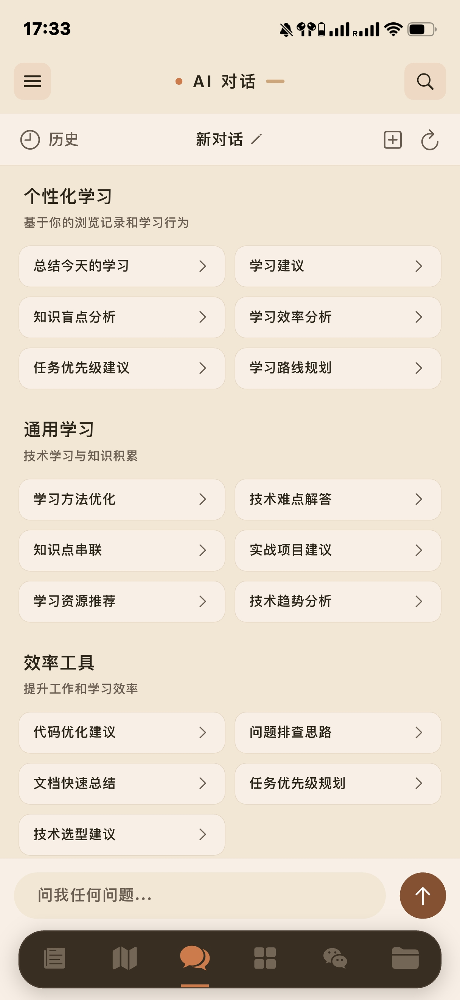
      <br />
      <sub>对话历史：按自由对话与文章上下文沉淀会话记录。</sub>
    </td>
    <td align="center" width="33%">
      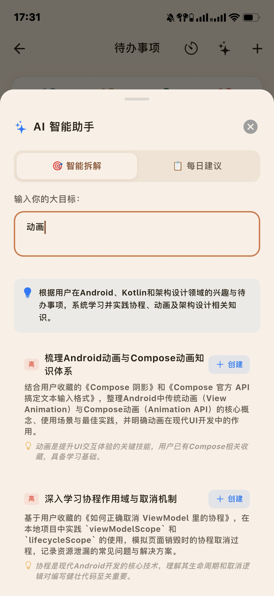
      <br />
      <sub>AI TODO 助手：把模糊目标拆成可执行任务，并给出理由。</sub>
    </td>
    <td align="center" width="33%">
      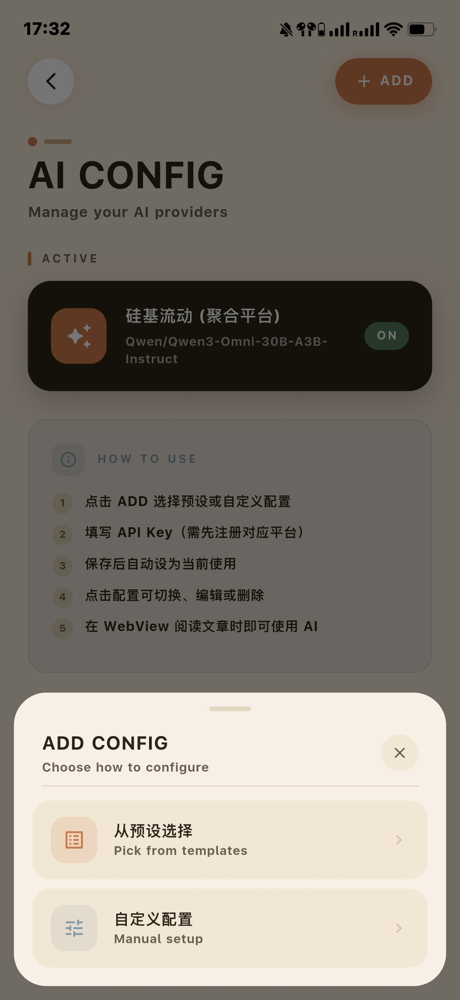
      <br />
      <sub>AI 配置：统一管理服务商、模型与自定义接入方式。</sub>
    </td>
  </tr>
  <tr>
    <td align="center" width="33%">
      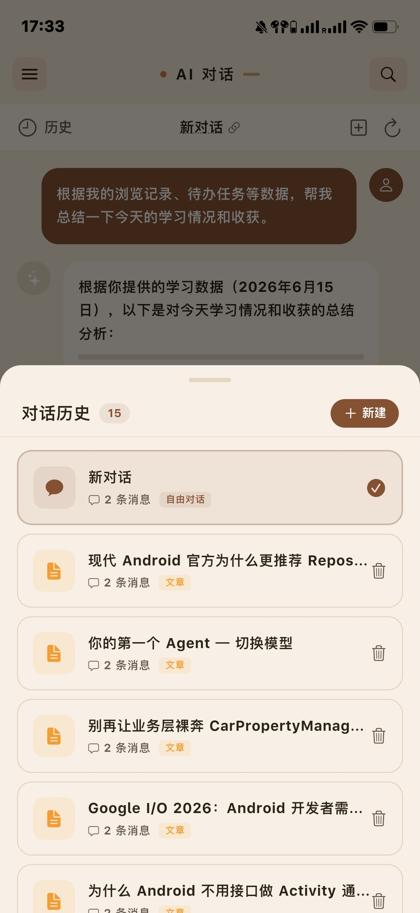
      <br />
      <sub>AI 对话详情：围绕具体问题展开多轮交流与结果生成。</sub>
    </td>
    <td align="center" width="33%">
      
      <br />
      <sub>AI 日报详情：把阅读回顾、任务进展、笔记动态和次日建议串起来。</sub>
    </td>
    <td align="center" width="33%">
      
      <br />
      <sub>场景联动：在问答内容页直接触发 AI，缩短从阅读到理解的路径。</sub>
    </td>
  </tr>
</table>


### 效率工具与补充页面

<table>
  <tr>
    <td align="center" width="33%">
      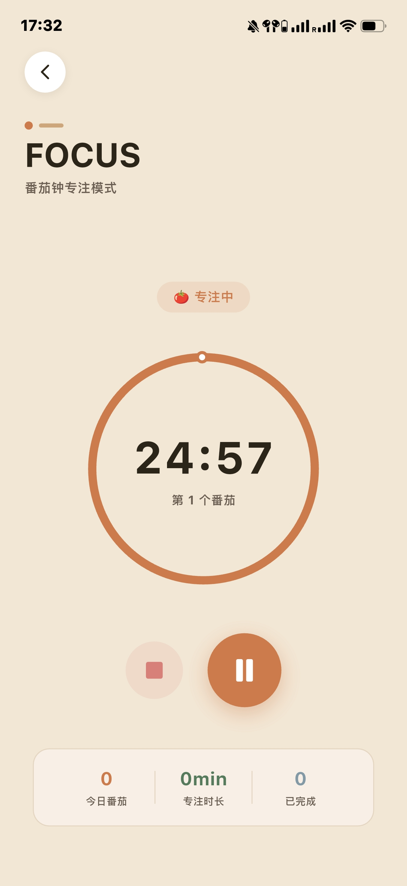
      <br />
      <sub>番茄钟：进入专注模式，把阅读与任务推进到具体时间块。</sub>
    </td>
    <td align="center" width="33%">
      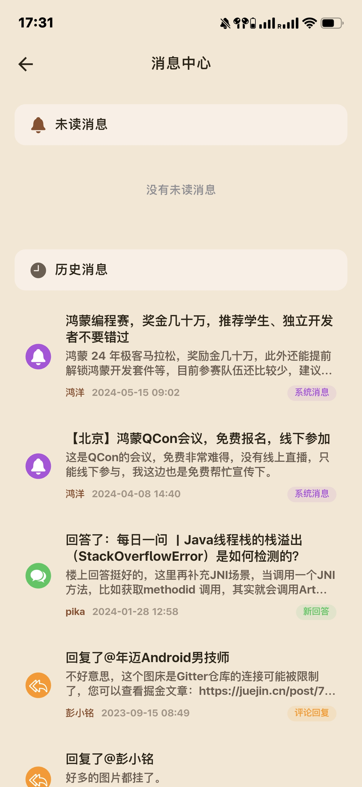
      <br />
      <sub>消息中心：查看系统消息、回复与历史互动。</sub>
    </td>
    <td align="center" width="33%">
      
      <br />
      <sub>AI 配置弹层：从预设或手动方式接入不同模型服务商。</sub>
    </td>
  </tr>
</table>

---

## 功能概览

### 内容与社区

- 首页聚合 Banner、置顶文章与推荐文章流
- 知识体系支持分类导航、知识树与图谱式浏览
- 公众号文章支持按号查看历史内容
- 项目页展示开源项目分类与列表
- 导航与每日问答帮助用户按专题发现内容
- 搜索、收藏、积分、消息、用户中心等 WanAndroid 常用能力完整保留

### 个人效率与知识管理

- 抽屉区提供 TODO、任务编辑、任务优先级与完成状态管理
- 集成番茄钟页面，支持专注节奏管理
- 内置本地笔记系统，可记录阅读摘要与想法
- 阅读统计页和浏览历史页沉淀个人阅读轨迹
- 登录态、主题模式、设置页等基础体验已经独立完善

### AI 智能能力

- AI 对话页支持通用聊天与文章上下文问答
- 支持 OpenAI、Claude、Gemini、智谱 AI、通义千问、DeepSeek 等多厂商配置
- AI 会基于当前文章内容构建上下文，适合做总结、问答、优缺点分析与实践建议
- 支持聊天记录持久化，保留上下文连续性
- 支持从阅读、TODO、笔记、收藏中采集用户画像，形成长期上下文
- 支持 AI 日报：汇总当天浏览、任务、笔记与收藏变化
- 支持 AI 周报：生成结构化周总结、成长评价与下周目标
- 支持 AI TODO 助手：拆解目标或给出个性化任务建议
- 支持笔记场景下的 AI 续写与 AI 润色
- 支持针对不同内容平台的文章正文抽取策略，便于 AI 获取干净语料

---

## 使用场景

### 1. 技术阅读增强

- 阅读 WanAndroid、公众号或外链文章时，直接发起 AI 问答
- 快速提炼文章要点、核心观点、适用场景与风险点
- 对一篇技术文章继续追问实现细节，而不是只停留在浏览阶段

### 2. 知识沉淀

- 看完文章后把摘要写进笔记，再用 AI 做续写或润色
- 把浏览记录、收藏行为和笔记内容累积成用户画像
- 后续 AI 回答可以更贴近用户当前关注方向

### 3. 学习规划与任务推进

- 将一个模糊目标交给 AI TODO 助手，拆成可以执行的子任务
- 结合待办列表和番茄钟，将“想学”变成“今天做什么”
- 用 AI 每日建议连接阅读内容与行动计划

### 4. 周期性复盘

- AI 日报适合每天快速回顾：今天读了什么、做了什么、还缺什么
- AI 周报适合每周复盘：本周输入输出、成长评分、下周目标
- 阅读统计和浏览历史为复盘提供可追溯数据基础

### 5. 多模型试验场

- 在同一应用中切换不同 AI 服务商配置
- 对比不同模型在总结、解释、任务规划场景下的输出效果
- 适合把该项目当作个人 AI 能力接入与交互体验的实验田

---

## 技术栈

### 客户端与状态管理

- Flutter
- Riverpod / Flutter Riverpod
- Cupertino + Material 混合界面

### 网络与存储

- Dio
- dio_cookie_manager
- dio_cache_interceptor
- MMKV
- SharedPreferences
- Sqflite

### 内容渲染与交互

- flutter_inappwebview
- flutter_html
- flutter_markdown
- cached_network_image
- carousel_slider
- pull_to_refresh_flutter3

### AI 与内容处理

- 多厂商 LLM 接入
- HTML 解析与正文抽取策略
- 流式响应
- 本地聊天记录、浏览历史与用户上下文采集

---

## 快速开始

### 环境要求

- Flutter `>= 3.4.3`
- Dart `>= 3.4.3`
- Android SDK `>= 21`
- iOS `>= 12.0`

### 安装运行

```bash
git clone https://github.com/xoliu1/Wandroid-Pro.git
cd Wandroid-Pro
flutter pub get
flutter run
```

如果你启用了代码生成相关能力，可按需执行：

```bash
flutter pub run build_runner build --delete-conflicting-outputs
```

### AI 配置

1. 打开侧边栏
2. 进入 `AI 配置`
3. 选择预设服务商或创建自定义服务商
4. 填入 `API Key`、模型名、接口地址等信息
5. 保存后即可在 AI 对话、日报、周报、TODO 助手等场景使用

---

## 项目结构

当前项目核心结构可概括为：

```text
lib/
├── ai/
│   ├── core/                    # 常量、日志、结果封装
│   ├── models/                  # AI 配置、聊天消息、文章内容、用户画像等模型
│   ├── providers/               # AI 对话、AI 日报、AI 周报、AI TODO、用户上下文
│   ├── repositories/            # 不同 AI 服务商仓库实现
│   ├── services/                # AIService、正文抽取、聊天记录、浏览历史、用户上下文
│   └── ui/                      # AI 相关页面与浮层组件
├── base/                        # 基础响应封装
├── local/                       # MMKV、本地搜索历史等轻量存储
├── model/                       # 文章、项目、消息、Todo、用户、数据库模型
├── pages/
│   ├── ai/                      # AI 聊天页
│   ├── article/                 # 首页文章、搜索
│   ├── chapter/                 # 导航、广场、每日问答
│   ├── coin/                    # 积分与排行
│   ├── collect/                 # 收藏
│   ├── drawer/                  # 侧边栏及其子页面
│   │   ├── message/             # 消息通知
│   │   ├── note/                # 笔记
│   │   └── todo/                # TODO 与番茄钟
│   ├── homepage/                # 主导航页
│   ├── knowledgeTree/           # 知识体系与图谱
│   ├── login/                   # 登录注册
│   ├── settings/                # 设置
│   ├── widget/                  # 通用卡片与组件
│   └── wxmp/                    # 公众号文章
├── providers/                   # 通用业务 Provider 与分页基类
├── remote/
│   ├── service/                 # NetworkService、缓存、接口抽象
│   ├── Api.dart                 # API 请求与响应定义
│   ├── CgiArticle.dart          # 文章业务封装
│   ├── CgiCollect.dart          # 收藏业务封装
│   ├── CgiTodo.dart             # Todo 业务封装
│   └── CgiUser.dart             # 用户业务封装
├── utils/                       # 主题、动画、鉴权、平台适配、颜色
└── main.dart                    # 应用入口
```

---

## 架构摘要

### 1. 导航组织

- `main.dart` 负责初始化 `MMKV`、`NetworkService`、全局 `ProviderContainer`
- `MainPage` 负责 6 个主 Tab 的延迟加载与主界面切换
- `HomeSlider` 负责侧边栏能力入口，包括 TODO、笔记、统计、AI 配置、日报周报等

### 2. 通用分页基类

项目中的列表状态大量复用 `lib/providers/pagination_provider.dart` 里的 `PaginationNotifier<T>`：

- 封装首次加载、刷新、加载更多
- 内置简单缓存
- 可配置 `pageSize`
- 统一输出 `AsyncValue<List<T>>`

这让文章流、列表页等数据加载模式更统一，Provider 层代码也更薄。

### 3. AI 服务层设计

`lib/ai/services/ai_service.dart` 是 AI 业务核心基类，负责：

- 构建不同场景的消息模板
- 统一处理文章上下文注入
- 支持纯对话、文章问答、笔记续写、笔记润色、日报、TODO 助手等多种 prompt 通道
- 通过 Repository 委托到具体模型服务商
- 支持流式输出与历史压缩

对应的 `AIProviderManager` 则负责多服务商配置的本地持久化与激活切换。

### 4. 内容抽取与平台策略

`lib/ai/services/content_extractor.dart` 使用策略模式识别不同内容平台：

- CSDN
- 掘金
- 微信公众号
- Generic fallback

这样 AI 获取到的是更干净的正文内容，而不是整页 WebView 噪音。

### 5. 用户画像与周期总结

应用会在后台采集阅读、收藏、笔记、TODO 等行为，形成 `UserContext`，并供 AI 场景复用：

- `user_context_provider.dart` 负责上下文初始化与防抖刷新
- `ai_daily_report_provider.dart` 汇总当天活动，生成结构化日报
- `ai_weekly_report_provider.dart` 汇总本周活动，生成结构化周报并持久化历史

这使 AI 不再只是单次问答，而是逐步演化成围绕用户长期行为工作的个人学习助手。

---

## API

Base URL:

```text
https://www.wanandroid.com
```

常用接口包括：

| 功能 | 方法 | 端点 |
|------|------|------|
| 首页文章列表 | GET | `/article/list/{page}/json` |
| Banner | GET | `/banner/json` |
| 登录 | POST | `/user/login` |
| 注册 | POST | `/user/register` |
| 收藏列表 | GET | `/lg/collect/list/{page}/json` |
| 搜索 | POST | `/article/query/{page}/json` |
| 知识体系 | GET | `/tree/json` |
| 项目分类 | GET | `/project/tree/json` |

WanAndroid 官方接口文档：[WanAndroid API](https://www.wanandroid.com/blog/show/2)

---

## 开发说明

### 常见命令

```bash
flutter pub get
flutter run
flutter test
flutter analyze
```

### 常见问题

编译失败时可先执行：

```bash
flutter clean
flutter pub get
flutter pub run build_runner build --delete-conflicting-outputs
```

iOS 依赖异常时可尝试：

```bash
cd ios
pod install
cd ..
flutter run
```

---

## Roadmap

- 继续扩展 AI 对阅读、笔记、待办之间的联动
- 打磨 AI 场景下的用户画像
- 完善更多内容平台的正文抽取策略
- 继续优化多端体验与主题细节

---

## 致谢

- [WanAndroid](https://www.wanandroid.com/)
- [Flutter](https://flutter.dev/)
- [Riverpod](https://riverpod.dev/)
