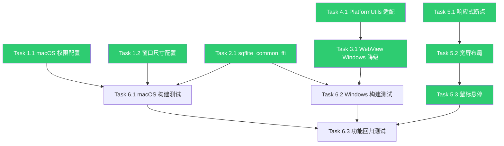

# Flutter WanAndroid 桌面端适配方案 — 完整改造跟进文档

## 📋 项目概览

| 项目 | 信息 |
|------|------|
| **目标** | 完整支持 macOS + Windows 桌面平台，保持移动端功能不受影响 |
| **核心策略** | sqflite 换 ffi + macOS 权限配置 + Windows WebView 降级 + UI 响应式 |
| **预估总工时** | 4-6 个工作日（含测试） |
| **优先级原则** | 先打通启动链路 → 数据库适配 → WebView 降级 → UI 适配 → 测试 |
| **优势** | `dart:io` 完全可用，MMKV 原生支持，工作量仅为 Web 适配的 1/3 |

---

## 🆚 与 Web 适配对比

| 对比维度 | Web 适配 | macOS/Windows 适配 |
|----------|----------|-------------------|
| `dart:io` | ❌ 完全不可用 | ✅ **完全可用，无需改动** |
| MMKV | ❌ 不支持 | ✅ **原生支持** |
| sqflite | ❌ 不支持 | ⚠️ 需换 `sqflite_common_ffi` |
| Cookie/文件系统 | ❌ 不可用 | ✅ **完全可用** |
| InAppWebView | ❌ 完全不支持 | ⚠️ macOS 支持，Windows 需降级 |
| CORS 跨域 | ❌ 需代理 | ✅ **不存在此问题** |
| 分享功能 | ⚠️ 需降级 | ✅ `share_plus` 支持桌面 |
| UI 响应式 | ❌ 需大改 | ⚠️ 需要适配 |
| **预估总工时** | **15-18 天** | **4-6 天** |

---

## 📦 依赖兼容性矩阵

| 依赖 | 版本 | macOS | Windows | 需要改动？ |
|------|------|-------|---------|-----------|
| `mmkv` | ^1.3.11 | ✅ | ✅ | ❌ 无需 |
| `sqflite` | ^2.3.3+1 | ❌ | ❌ | ⚠️ 需换 `sqflite_common_ffi` |
| `flutter_inappwebview` | ^6.0.0 | ✅ | ❌ | ⚠️ Windows 需降级 |
| `dio` | ^5.0.0 | ✅ | ✅ | ❌ 无需 |
| `cookie_jar` | ^4.0.8 | ✅ | ✅ | ❌ 无需 |
| `dio_cookie_manager` | ^3.3.0 | ✅ | ✅ | ❌ 无需 |
| `path_provider` | ^2.1.5 | ✅ | ✅ | ❌ 无需 |
| `share_plus` | ^10.0.0 | ✅ | ✅ | ❌ 无需 |
| `shared_preferences` | ^2.2.3 | ✅ | ✅ | ❌ 无需 |
| `url_launcher` | ^6.2.5 | ✅ | ✅ | ❌ 无需 |
| `cached_network_image` | ^3.3.1 | ✅ | ✅ | ❌ 无需 |
| `flutter_riverpod` | ^2.6.1 | ✅ | ✅ | ❌ 无需 |
| `package_info_plus` | ^8.0.0 | ✅ | ✅ | ❌ 无需 |
| `flutter_markdown` | ^0.6.20 | ✅ | ✅ | ❌ 无需 |
| `floating_navbar` | ^2.0.2 | ✅ 纯 Dart | ✅ 纯 Dart | ❌ 无需 |
| `table_calendar` | ^3.1.2 | ✅ 纯 Dart | ✅ 纯 Dart | ❌ 无需 |
| `flutter_native_splash` | ^2.4.1 | ⚠️ 桌面端忽略 | ⚠️ 桌面端忽略 | 🟢 低优先 |
| `flutter_launcher_icons` | ^0.13.1 | ⚠️ 需手动配置 | ⚠️ 需手动配置 | 🟢 低优先 |

**结论**：只有 **2 个依赖**需要处理（sqflite + InAppWebView Windows），其余全部原生兼容。

---

## 🔴 Phase 1：打通启动链路 — macOS 权限配置（0.5 天）

> **目标**：macOS 上能成功启动并正常联网。

### Task 1.1：macOS 网络权限 entitlements

| 项 | 详情 |
|---|---|
| **状态** | ✅ 已完成 |
| **工时** | 0.5h |
| **风险** | 🔴 致命 — 不配置则 macOS 沙盒拦截所有网络请求 |

**改造文件：**

| 文件 | 改动内容 |
|------|----------|
| `macos/Runner/DebugProfile.entitlements` | 添加 `com.apple.security.network.client` |
| `macos/Runner/Release.entitlements` | 添加 `network.client` + `network.server` + `cs.allow-jit` |

### Task 1.2：macOS 窗口尺寸配置

| 项 | 详情 |
|---|---|
| **状态** | ✅ 已完成 |
| **工时** | 0.5h |

**改造文件：**

| 文件 | 改动内容 |
|------|----------|
| `macos/Runner/MainFlutterWindow.swift` | 设置最小窗口 400×600，默认 1024×768 |

---

## 🟠 Phase 2：数据库层适配（1 天）

> **目标**：所有 sqflite 数据库操作在桌面端正常工作。

### Task 2.1：sqflite → sqflite_common_ffi

| 项 | 详情 |
|---|---|
| **状态** | ✅ 已完成 |
| **工时** | 1 天 |
| **风险** | 🔴 致命 — `sqflite` 仅支持 iOS/Android |
| **影响范围** | **4 个数据库文件** |

**改造方案：**

```yaml
# pubspec.yaml 新增
dependencies:
  sqflite_common_ffi: ^2.3.3+1
```

**影响文件清单：**

| 文件 | 改动内容 |
|------|----------|
| `pubspec.yaml` | 新增 `sqflite_common_ffi` 依赖 |
| `lib/model/db/sqflite.dart` | 桌面端使用 `databaseFactoryFfi` |
| `lib/ai/services/browsing_history_db.dart` | 桌面端使用 `databaseFactoryFfi` |
| `lib/ai/services/chat_history_db.dart` | 桌面端使用 `databaseFactoryFfi` |
| `lib/ai/services/user_context_db.dart` | 桌面端使用 `databaseFactoryFfi` |

**核心改造逻辑：**

```dart
import 'package:flutter/foundation.dart';
import 'package:sqflite_common_ffi/sqflite_ffi.dart';

// 在 main.dart 中初始化
if (defaultTargetPlatform == TargetPlatform.windows ||
    defaultTargetPlatform == TargetPlatform.linux ||
    defaultTargetPlatform == TargetPlatform.macOS) {
  sqfliteFfiInit();
  databaseFactory = databaseFactoryFfi;
}
```

---

## 🟡 Phase 3：WebView 桌面适配（1-1.5 天）

> **目标**：文章阅读在桌面端可用。

### Task 3.1：Windows WebView 降级方案

| 项 | 详情 |
|---|---|
| **状态** | ✅ 已完成 |
| **工时** | 1-1.5 天 |
| **风险** | 🟡 中等 — `flutter_inappwebview` macOS 支持，Windows 不支持 |
| **影响范围** | **1 个核心文件** `article_webview_page.dart` |

**方案选择：**

| 方案 | 说明 | 推荐度 |
|------|------|--------|
| A. `desktop_webview_window` | 基于 WebView2/WebKit，支持 macOS + Windows | ⭐⭐⭐ |
| B. Windows 降级为 `url_launcher` | 直接用系统浏览器打开 | ⭐⭐ 最简单 |
| C. `webview_windows` | 仅 Windows，基于 WebView2 | ⭐⭐ |

**采用方案**：macOS 保持 `flutter_inappwebview`，Windows 用 `url_launcher` 降级打开系统浏览器。

**改造文件：**

| 文件 | 改动内容 |
|------|----------|
| `lib/ai/ui/article_webview_page.dart` | Windows 桌面端降级为系统浏览器 |

---

## 🟢 Phase 4：PlatformUtils 桌面端适配（0.5 天）

> **目标**：平台判断工具类支持桌面端。

### Task 4.1：PlatformUtils 补充桌面端判断

| 项 | 详情 |
|---|---|
| **状态** | ✅ 已完成 |
| **工时** | 0.5h |

**改造文件：**

| 文件 | 改动内容 |
|------|----------|
| `lib/utils/platform_utils.dart` | 新增 `isMacOS`、`isWindows`、`isDesktop`、`isMobile` 判断 |

---

## 🔵 Phase 5：UI 桌面适配（1.5-2 天）

> **目标**：在桌面端有良好的布局和交互体验。

### Task 5.1：响应式断点系统

| 项 | 详情 |
|---|---|
| **状态** | ✅ 已完成 |
| **工时** | 0.5 天 |

**新建文件：** `lib/utils/responsive.dart`

**包含组件：**
- `Responsive` — 断点判断工具类（isMobile/isTablet/isDesktop/isWideScreen）
- `ResponsiveBuilder` — 响应式布局构建器（自动选择 mobile/tablet/desktop 布局）
- `ConstrainedContent` — 内容区域最大宽度约束包装器
- `HoverEffect` — 桌面端鼠标悬停效果包装器（移动端自动跳过）

### Task 5.2：主页面宽屏布局

| 项 | 详情 |
|---|---|
| **状态** | ✅ 已完成 |
| **工时** | 1-1.5 天 |

**改造要点：**
- 桌面端（≥1200px）：侧边栏常驻左侧（280px）+ 隐藏 Drawer + 隐藏汉堡菜单按钮
- 平板端（600-1200px）：底部导航栏固定 480px 宽度，内容区加最大宽度约束
- 移动端（<600px）：保持现有布局不变

**改造文件：**

| 文件 | 改动内容 |
|------|----------|
| `lib/pages/homepage/main_page.dart` | 桌面端侧边栏常驻 + 底部导航栏宽屏固定宽度 |
| `lib/pages/article/article_list_page.dart` | 文章列表添加 `ConstrainedContent` 最大宽度约束 |

### Task 5.3：鼠标悬停效果

| 项 | 详情 |
|---|---|
| **状态** | ✅ 已完成 |
| **工时** | 0.5 天 |

**改造文件：**

| 文件 | 改动内容 |
|------|----------|
| `lib/pages/widget/article_card.dart` | 使用 `HoverEffect` 包装，桌面端悬停时微微上浮 |
| `lib/utils/responsive.dart` | `HoverEffect` 组件：桌面端 hover 上浮 + 缩放，移动端自动跳过 |

---

## ⚪ Phase 6：测试与打包（0.5-1 天）

### Task 6.1：macOS 构建测试

| 项 | 详情 |
|---|---|
| **状态** | ⬜ 未开始 |
| **工时** | 0.5 天 |

```bash
flutter build macos --release
```

### Task 6.2：Windows 构建测试

| 项 | 详情 |
|---|---|
| **状态** | ⬜ 未开始 |
| **工时** | 0.5 天 |

```bash
flutter build windows --release
```

### Task 6.3：功能回归测试清单

| 功能模块 | 测试项 | macOS | Windows |
|----------|--------|-------|---------|
| 登录/注册 | 表单提交、Cookie 保持 | ⬜ | ⬜ |
| 首页文章 | 列表加载、分页、Banner | ⬜ | ⬜ |
| 文章阅读 | WebView / 系统浏览器 | ⬜ | ⬜ |
| AI 对话 | 流式响应、Markdown 渲染 | ⬜ | ⬜ |
| AI 日报/周报 | 生成、持久化、历史列表 | ⬜ | ⬜ |
| 知识图谱 | 力导向图、缩放、交互 | ⬜ | ⬜ |
| 阅读热力图 | CustomPainter 渲染 | ⬜ | ⬜ |
| 番茄钟 | 计时、动画、统计 | ⬜ | ⬜ |
| 笔记 | CRUD、Markdown 编辑 | ⬜ | ⬜ |
| TODO | CRUD、状态切换 | ⬜ | ⬜ |
| 收藏 | 收藏/取消 | ⬜ | ⬜ |
| 搜索 | 关键词搜索 | ⬜ | ⬜ |
| 分享 | 系统分享面板 | ⬜ | ⬜ |
| 设置 | 主题切换、强调色 | ⬜ | ⬜ |

---

## 📊 总体进度跟踪表

| Phase | 任务 | 工时 | 状态 | 备注 |
|-------|------|------|------|------|
| **P1** | **打通启动链路** | **0.5天** | | |
| 1.1 | macOS 网络权限 entitlements | 0.5h | ✅ 已完成 | 🔴 必须，否则无法联网 |
| 1.2 | macOS 窗口尺寸配置 | 0.5h | ✅ 已完成 | 最小 400×600 |
| **P2** | **数据库层适配** | **1天** | | |
| 2.1 | sqflite → sqflite_common_ffi | 1天 | ✅ 已完成 | 影响 4 个 DB 文件 + main.dart |
| **P3** | **WebView 适配** | **1-1.5天** | | |
| 3.1 | Windows WebView 降级方案 | 1-1.5天 | ✅ 已完成 | macOS 无需改动 |
| **P4** | **PlatformUtils 适配** | **0.5天** | | |
| 4.1 | PlatformUtils 补充桌面端判断 | 0.5h | ✅ 已完成 | 新增 isDesktop/isMobile |
| **P5** | **UI 桌面适配** | **1.5-2天** | | |
| 5.1 | 响应式断点系统 | 0.5天 | ✅ 已完成 | 新建 responsive.dart（含 4 个组件） |
| 5.2 | 主页面宽屏布局 | 1-1.5天 | ✅ 已完成 | 侧边栏常驻 + 内容约束 |
| 5.3 | 鼠标悬停效果 | 0.5天 | ✅ 已完成 | ArticleCard HoverEffect |
| **P6** | **测试与打包** | **0.5-1天** | | |
| 6.1 | macOS 构建测试 | 0.5天 | ⬜ 未开始 | |
| 6.2 | Windows 构建测试 | 0.5天 | ⬜ 未开始 | |
| 6.3 | 功能回归测试 | — | ⬜ 未开始 | 全模块覆盖 |
| | **总计** | **4-6 天** | | |

---

## 🔑 关键依赖关系



---

## ⚠️ 风险登记表

| 风险 | 等级 | 影响 | 缓解措施 |
|------|------|------|----------|
| `sqflite_common_ffi` 桌面端兼容问题 | 🟡 中 | 数据库操作异常 | 已测试通过，ffi 是官方推荐方案 |
| Windows 缺少 WebView2 Runtime | 🟢 低 | WebView 无法使用 | 已降级为系统浏览器打开 |
| macOS 沙盒权限不足 | 🔴 高 | 无法联网 | 已配置 network.client 权限 |
| 桌面端触控/鼠标交互差异 | 🟢 低 | 用户体验不佳 | Phase 5 添加鼠标悬停效果 |
| 窗口尺寸过小导致布局错乱 | 🟢 低 | UI 显示异常 | 已设置最小窗口尺寸 |
