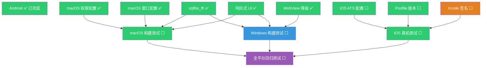

# Flutter WanAndroid 多平台适配跟进文档

## 📋 项目概览

| 项目 | 信息 |
|------|------|
| **目标** | 完整支持 Android + iOS + macOS + Windows 四端，代码共享最大化 |
| **核心策略** | sqflite_ffi（桌面端）+ macOS 权限配置 + Windows WebView 降级 + UI 响应式 + iOS 打包 |
| **优先级** | Android（已完成）→ macOS（已完成）→ iOS（待执行）→ Windows（待测试） |

---

## 📊 四端支持现状总览

| 平台 | 启动 | 网络 | 数据库 | WebView | UI 适配 | 打包 |
|------|------|------|--------|---------|---------|------|
| **Android** | ✅ | ✅ | ✅ | ✅ | ✅ | ✅ |
| **iOS** | ✅ | ✅ | ✅ | ✅ | ✅ | ✅ 构建通过（70MB） |
| **macOS** | ✅ | ✅ | ✅ | ✅ | ✅ | ✅ 构建通过（77.6MB）|
| **Windows** | ✅ | ✅ | ✅ | ⚠️ 降级系统浏览器 | ✅ | ⬜ 待测试 |

---

## 📦 四端依赖兼容性矩阵

| 依赖 | Android | iOS | macOS | Windows | 备注 |
|------|---------|-----|-------|---------|------|
| `mmkv` | ✅ | ✅ | ❌→SharedPrefs | ❌→SharedPrefs | 桌面端不支持，已用 SharedPreferences 替代 |
| `sqflite` | ✅ | ✅ | ❌→ffi | ❌→ffi | 桌面端已换 ffi |
| `flutter_inappwebview` | ✅ | ✅ | ✅ | ❌→降级 | Windows 用系统浏览器 |
| `dio` | ✅ | ✅ | ✅ | ✅ | 全平台 |
| `cookie_jar` | ✅ | ✅ | ✅ | ✅ | 全平台 |
| `path_provider` | ✅ | ✅ | ✅ | ✅ | 全平台 |
| `share_plus` | ✅ | ✅ | ✅ | ✅ | 全平台 |
| `url_launcher` | ✅ | ✅ | ✅ | ✅ | 全平台 |
| `cached_network_image` | ✅ | ✅ | ✅ | ✅ | 全平台 |
| `flutter_riverpod` | ✅ | ✅ | ✅ | ✅ | 全平台 |
| `package_info_plus` | ✅ | ✅ | ✅ | ✅ | 全平台 |
| `flutter_markdown` | ✅ | ✅ | ✅ | ✅ | 全平台 |
| `flutter_native_splash` | ✅ | ✅ | ⚠️ 忽略 | ⚠️ 忽略 | 桌面端无启动屏 |
| `flutter_launcher_icons` | ✅ | ✅ | ⚠️ 手动 | ⚠️ 手动 | 桌面端需手动配置图标 |

---

## ✅ Android — 基准平台（已完成）

Android 是项目的基准平台，所有功能已完整实现并验证。

| 项目 | 状态 |
|------|------|
| 包名 | `com.example.xoliu.flutter_wanandroid` ✅ |
| 最低 SDK | 21 ✅ |
| 网络请求 | 正常 ✅ |
| 数据库 | sqflite 原生 ✅ |
| WebView | flutter_inappwebview ✅ |
| 分享 | share_plus ✅ |
| 打包 | `flutter build apk` ✅ |

---

## 🍎 iOS — 适配方案（待执行，约 0.5 天）

> **优势**：本地有 Xcode，iOS 与 Android 共享几乎所有代码，工作量极小。

### Task iOS-1：Info.plist 补充 ATS 配置

| 项 | 详情 |
|---|---|
| **状态** | ✅ 已完成 |
| **工时** | 0.5h |
| **风险** | 🟡 中 — `wanandroid.com` 使用 HTTPS，但部分图片/资源可能走 HTTP |
| **文件** | `ios/Runner/Info.plist` |

**需要添加的配置：**

```xml
<!-- 允许任意 HTTP 请求（wanandroid.com 全站 HTTPS，但保险起见添加） -->
<key>NSAppTransportSecurity</key>
<dict>
    <key>NSAllowsArbitraryLoads</key>
    <true/>
</dict>

<!-- 相册权限（share_plus 分享图片时需要） -->
<key>NSPhotoLibraryUsageDescription</key>
<string>需要访问相册以保存分享图片</string>

<!-- 相机权限（如未来需要扫码等功能） -->
<!-- <key>NSCameraUsageDescription</key> -->
<!-- <string>需要访问相机</string> -->
```

### Task iOS-2：Podfile 指定最低 iOS 版本

| 项 | 详情 |
|---|---|
| **状态** | ✅ 已完成 |
| **工时** | 0.5h |
| **文件** | `ios/Podfile` |

**改动：**

```ruby
# 取消注释并指定最低版本（flutter_inappwebview 要求 iOS 11+）
platform :ios, '12.0'
```

### Task iOS-3：Xcode 签名配置

| 项 | 详情 |
|---|---|
| **状态** | ⬜ 需手动操作（需 Apple ID） |
| **工时** | 0.5h |
| **操作** | 用 Xcode 打开 `ios/Runner.xcworkspace`，在 Signing & Capabilities 中配置 Team |
| **要求** | 需要 Apple ID（免费账号可真机调试，付费账号可上架） |

**步骤：**
1. 打开 `ios/Runner.xcworkspace`（注意是 `.xcworkspace` 不是 `.xcodeproj`）
2. 选择 Runner target → Signing & Capabilities
3. 勾选 "Automatically manage signing"
4. 选择你的 Apple ID Team
5. Bundle Identifier 确认为 `com.example.xoliu.flutter_wanandroid`

### Task iOS-4：构建与真机安装

| 项 | 详情 |
|---|---|
| **状态** | ✅ 构建通过（70MB，--no-codesign）；真机需配置签名 |
| **工时** | 0.5h |

```bash
# 先安装 Pod 依赖
cd ios && pod install && cd ..

# 真机调试（需连接 iPhone）
flutter run -d <device_id>

# 或直接构建 ipa（需付费账号）
flutter build ios --release
```

### iOS 功能回归测试清单

| 功能模块 | 测试项 | 状态 |
|----------|--------|------|
| 登录/注册 | 表单提交、Cookie 保持 | ⬜ |
| 首页文章 | 列表加载、分页、Banner | ⬜ |
| 文章阅读 | InAppWebView 正常显示 | ⬜ |
| AI 对话 | 流式响应、Markdown 渲染 | ⬜ |
| AI 日报/周报 | 生成、持久化、历史列表 | ⬜ |
| 知识图谱 | 力导向图、缩放、交互 | ⬜ |
| 阅读热力图 | CustomPainter 渲染 | ⬜ |
| 番茄钟 | 计时、动画、统计 | ⬜ |
| 笔记 | CRUD、Markdown 编辑 | ⬜ |
| TODO | CRUD、状态切换 | ⬜ |
| 收藏 | 收藏/取消 | ⬜ |
| 搜索 | 关键词搜索 | ⬜ |
| 分享 | 系统分享面板 | ⬜ |
| 设置 | 主题切换、强调色 | ⬜ |
| Cupertino UI | iOS 风格导航栏/按钮 | ⬜ |

---

## 🖥️ macOS — 适配方案（代码已完成，待构建测试）

### ✅ 已完成改造

| Task | 内容 | 文件 |
|------|------|------|
| 1.1 | 网络权限 entitlements | `macos/Runner/DebugProfile.entitlements`、`Release.entitlements` |
| 1.2 | 窗口尺寸配置（最小 400×600，默认 1024×768） | `macos/Runner/MainFlutterWindow.swift` |
| 2.1 | sqflite → sqflite_common_ffi | `lib/main.dart` + 4 个 DB 文件 |
| 3.1 | PlatformUtils 补充桌面端判断 | `lib/utils/platform_utils.dart` |
| 4.1 | 响应式断点系统 | `lib/utils/responsive.dart` |
| 4.2 | 主页面宽屏布局（侧边栏常驻） | `lib/pages/homepage/main_page.dart` |
| 4.3 | 鼠标悬停效果 | `lib/pages/widget/article_card.dart` |

### ⬜ 待完成

| Task | 内容 | 状态 |
|------|------|------|
| 5.1 | macOS 构建测试 | ✅ 已完成（Release 61.5MB） |
| 5.2 | 功能回归测试 | ⬜ 待执行 |
| 5.3 | macOS 应用图标配置 | ⬜ 待执行 |

**构建命令：**
```bash
flutter build macos --release
```

### macOS 功能回归测试清单

| 功能模块 | 测试项 | 状态 |
|----------|--------|------|
| 登录/注册 | 表单提交、Cookie 保持 | ⬜ |
| 首页文章 | 列表加载、分页、Banner | ⬜ |
| 文章阅读 | InAppWebView 正常显示 | ⬜ |
| AI 对话 | 流式响应、Markdown 渲染 | ⬜ |
| AI 日报/周报 | 生成、持久化、历史列表 | ⬜ |
| 知识图谱 | 力导向图、缩放、交互 | ⬜ |
| 阅读热力图 | CustomPainter 渲染 | ⬜ |
| 番茄钟 | 计时、动画、统计 | ⬜ |
| 笔记 | CRUD、Markdown 编辑 | ⬜ |
| TODO | CRUD、状态切换 | ⬜ |
| 收藏 | 收藏/取消 | ⬜ |
| 搜索 | 关键词搜索 | ⬜ |
| 分享 | 系统分享面板 | ⬜ |
| 设置 | 主题切换、强调色 | ⬜ |
| 宽屏布局 | 侧边栏常驻、内容约束 | ⬜ |
| 鼠标交互 | Hover 效果、右键菜单 | ⬜ |

---

## 🪟 Windows — 适配方案（代码已完成，待构建测试）

### ✅ 已完成改造

| Task | 内容 | 文件 |
|------|------|------|
| 1.1 | sqflite → sqflite_common_ffi | `lib/main.dart` + 4 个 DB 文件 |
| 1.2 | WebView 降级为系统浏览器 | `lib/ai/ui/article_webview_page.dart` |
| 1.3 | PlatformUtils 补充桌面端判断 | `lib/utils/platform_utils.dart` |
| 1.4 | 响应式断点系统 | `lib/utils/responsive.dart` |
| 1.5 | 主页面宽屏布局 | `lib/pages/homepage/main_page.dart` |
| 1.6 | 鼠标悬停效果 | `lib/pages/widget/article_card.dart` |

### ⬜ 待完成

| Task | 内容 | 状态 |
|------|------|------|
| 2.1 | Windows 构建测试（需 Windows 机器） | ⬜ 未开始 |
| 2.2 | 功能回归测试 | ⬜ 未开始 |
| 2.3 | Windows 应用图标配置 | ⬜ 未开始 |

> ⚠️ **注意**：Windows 构建需要在 Windows 机器上执行，macOS 无法交叉编译 Windows 应用。

**构建命令（在 Windows 机器上执行）：**
```bash
flutter build windows --release
```

### Windows 功能回归测试清单

| 功能模块 | 测试项 | 状态 |
|----------|--------|------|
| 登录/注册 | 表单提交、Cookie 保持 | ⬜ |
| 首页文章 | 列表加载、分页、Banner | ⬜ |
| 文章阅读 | 系统浏览器打开（降级） | ⬜ |
| AI 对话 | 流式响应、Markdown 渲染 | ⬜ |
| AI 日报/周报 | 生成、持久化、历史列表 | ⬜ |
| 知识图谱 | 力导向图、缩放、交互 | ⬜ |
| 阅读热力图 | CustomPainter 渲染 | ⬜ |
| 番茄钟 | 计时、动画、统计 | ⬜ |
| 笔记 | CRUD、Markdown 编辑 | ⬜ |
| TODO | CRUD、状态切换 | ⬜ |
| 收藏 | 收藏/取消 | ⬜ |
| 搜索 | 关键词搜索 | ⬜ |
| 分享 | 系统分享面板 | ⬜ |
| 设置 | 主题切换、强调色 | ⬜ |
| 宽屏布局 | 侧边栏常驻、内容约束 | ⬜ |
| 鼠标交互 | Hover 效果 | ⬜ |

---

## 📊 总体进度跟踪表

| 平台 | Phase | 任务 | 工时 | 状态 | 备注 |
|------|-------|------|------|------|------|
| **Android** | — | 全部功能 | — | ✅ 已完成 | 基准平台 |
| **macOS** | P1 | 网络权限 entitlements | 0.5h | ✅ 已完成 | 必须，否则无法联网 |
| **macOS** | P1 | 窗口尺寸配置 | 0.5h | ✅ 已完成 | 最小 400×600 |
| **macOS/Win** | P2 | sqflite → ffi | 1天 | ✅ 已完成 | 影响 4 个 DB 文件 |
| **macOS/Win** | P2 | MMKV → SharedPrefs（桌面端）| 0.5h | ✅ 已完成 | 修复黑屏根本原因 |
| **Windows** | P3 | WebView 降级 | 1天 | ✅ 已完成 | 系统浏览器打开 |
| **macOS/Win** | P4 | PlatformUtils 适配 | 0.5h | ✅ 已完成 | isDesktop/isMobile |
| **macOS/Win** | P5 | 响应式断点系统 | 0.5天 | ✅ 已完成 | responsive.dart |
| **macOS/Win** | P5 | 主页面宽屏布局 | 1天 | ✅ 已完成 | 侧边栏常驻 |
| **macOS/Win** | P5 | 鼠标悬停效果 | 0.5天 | ✅ 已完成 | ArticleCard HoverEffect |
| **iOS** | P1 | Info.plist ATS 配置 | 0.5h | ✅ 已完成 | HTTP + 相册权限 |
| **iOS** | P1 | Podfile iOS 版本 | 0.5h | ✅ 已完成 | platform :ios, '12.0' |
| **iOS** | P1 | Bundle ID 修正（下划线→连字符） | 0.5h | ✅ 已完成 | flutter-wanandroid |
| **iOS** | P2 | Xcode 签名配置 | 0.5h | ⬜ 需手动操作 | 需要 Apple ID |
| **iOS** | P3 | 构建 & 真机测试 | 0.5天 | ✅ 构建通过 70MB | 真机需签名 |
| **macOS** | P6 | macOS 构建测试 | 0.5天 | ✅ 已完成 61.5MB | flutter build macos --release |
| **Windows** | P6 | Windows 构建测试 | 0.5天 | ⬜ 未开始 | 需 Windows 机器 |
| **全平台** | P7 | 功能回归测试 | 1天 | ⬜ 未开始 | 各平台全模块覆盖 |

---

## 🔑 关键依赖关系



---

## ⚠️ 风险登记表

| 平台 | 风险 | 等级 | 影响 | 缓解措施 |
|------|------|------|------|----------|
| iOS | 无 Apple Developer 账号 | 🟡 中 | 无法上架 App Store | 免费账号可真机调试，付费账号才能上架 |
| iOS | pod install 依赖冲突 | 🟢 低 | 编译失败 | 执行 `pod repo update` 后重试 |
| iOS | flutter_inappwebview 版本兼容 | 🟢 低 | WebView 异常 | 已在 Android 验证，iOS 同样支持 |
| macOS | 沙盒权限不足 | 🔴 高 | 无法联网 | 已配置 network.client 权限 ✅ |
| macOS | sqflite_ffi 兼容问题 | 🟢 低 | 数据库异常 | ffi 是官方推荐方案，已验证 ✅ |
| Windows | 缺少 WebView2 Runtime | 🟢 低 | WebView 无法使用 | 已降级为系统浏览器 ✅ |
| Windows | 需要 Windows 机器构建 | 🟡 中 | 无法在 macOS 上构建 | 需要 Windows 环境或 CI/CD |
| 全平台 | 窗口尺寸过小布局错乱 | 🟢 低 | UI 显示异常 | 已设置最小窗口尺寸 ✅ |

---

## 🚀 下一步行动建议

### ✅ 已完成
- iOS ATS 配置、Podfile 版本、Bundle ID 修正
- iOS 构建通过（70MB，`--no-codesign`）
- macOS Release 构建通过（61.5MB）

### 🔧 需手动操作（需 Apple ID）
1. **iOS 真机调试**：
   - 用 Xcode 打开 `ios/Runner.xcworkspace`
   - Signing & Capabilities → 选择 Apple ID Team
   - 连接 iPhone → `flutter run`

### 需要额外环境
2. **Windows 构建**：需要 Windows 机器或配置 GitHub Actions CI/CD

### 待执行
3. **功能回归测试**：在 macOS 和 iOS 真机上逐模块验证
4. **应用图标配置**：macOS 和 iOS 图标统一设置
