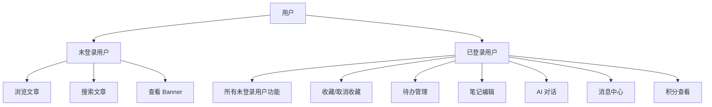
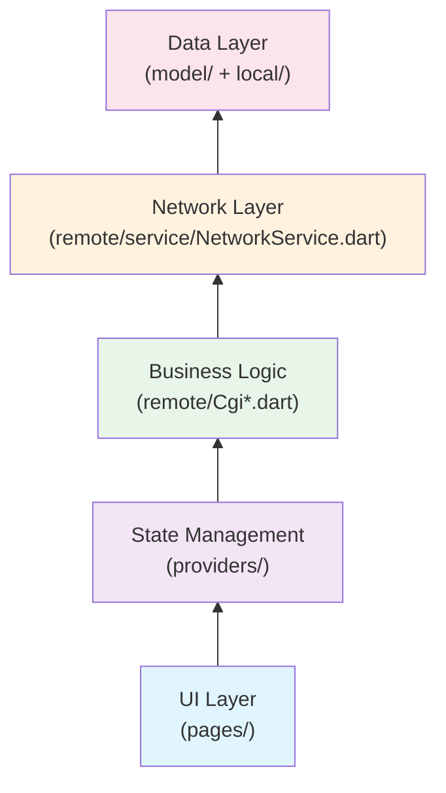
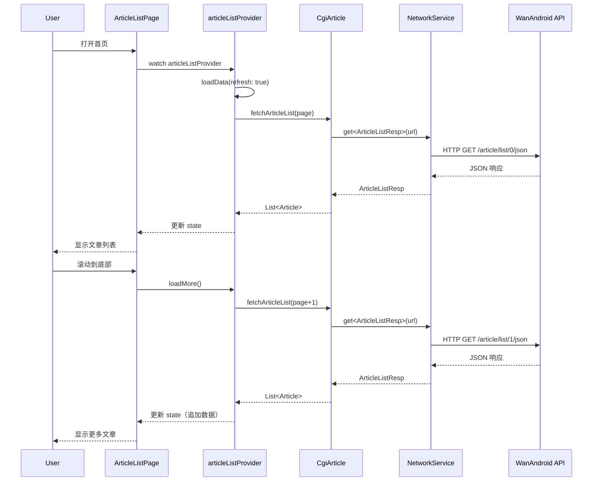
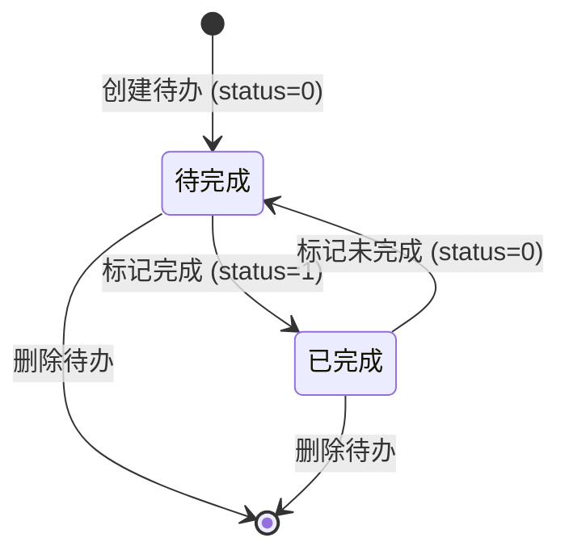
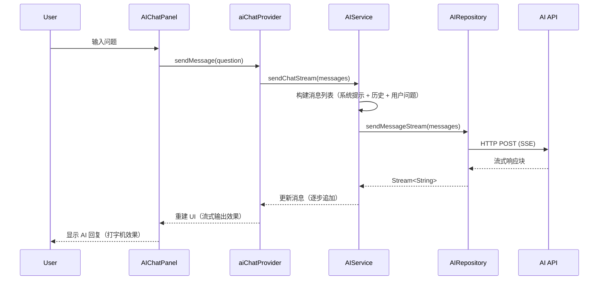
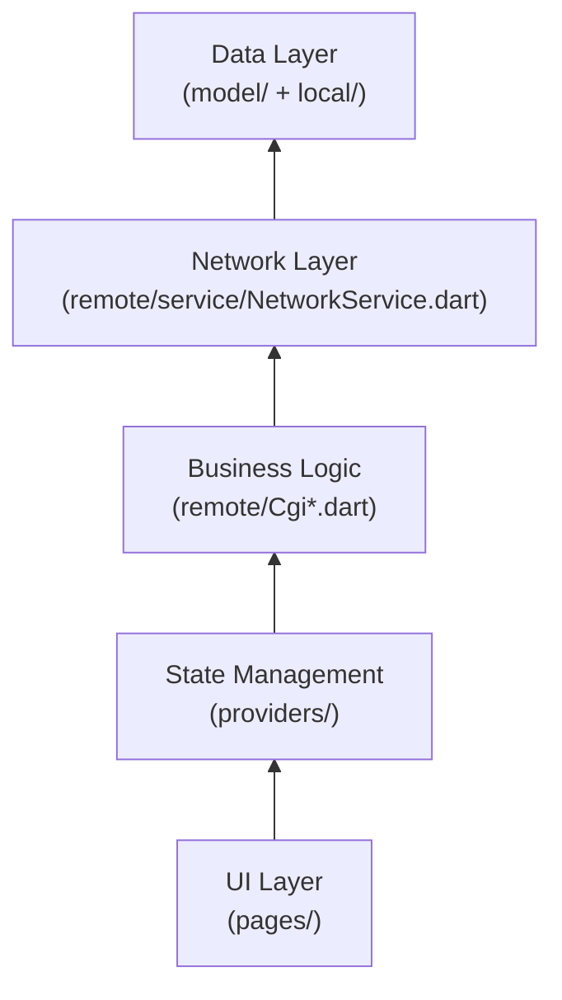
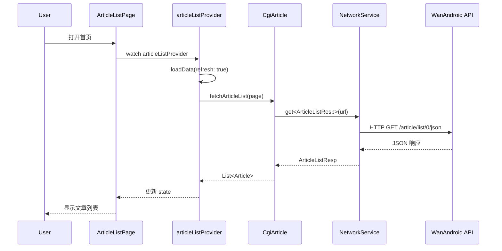

# 基于 Flutter 的跨平台任务管理应用 - 项目技术文档

> **项目名称**：Flutter WanAndroid (Task Keeper)  
> **技术栈**：Flutter + Riverpod + Dio + MMKV + SQLite  
> **开发语言**：Dart  
> **目标平台**：iOS / Android / macOS / Windows / Linux / Web  
> **文档版本**：v1.0  
> **编写日期**：2026-04-23  

---

> **💼 文档定位**  
> 本文档为面向开发的技术文档，聚焦项目实现细节和技术方案，包含系统架构、模块设计、核心代码片段、技术亮点等内容。适用于项目交接、AI理解项目、技术分享和二次开发。
>
> **🎯 主要用途**  
> 1. **AI辅助开发**：将本文档提供给AI，帮助AI理解项目架构和规范，生成符合项目标准的代码
> 2. **项目交接**：新成员快速了解项目的技术选型、架构设计和实现方案
> 3. **技术分享**：向团队或外部展示项目的技术亮点和最佳实践
>
> **🔗 相关文档**  
> - 如需学术论文版本，请参阅 [毕业设计论文](./毕业设计论文-基于Flutter的跨平台任务管理应用设计与实现.md)
> - 如需开发新功能，请参阅 [开发指南](./DEVELOPMENT_GUIDE.md)
> - 如需了解架构细节，请参阅 [架构可视化](./ARCHITECTURE_DIAGRAM.md)

---

## 目录

1. [项目概述](#1-项目概述)
2. [技术栈分析](#2-技术栈分析)
3. [需求分析](#3-需求分析)
4. [系统设计](#4-系统设计)
5. [系统实现](#5-系统实现)
6. [项目亮点](#6-项目亮点)
7. [附录](#7-附录)

---

## 1. 项目概述

### 1.1 项目背景

随着移动互联网的快速发展，跨平台应用开发逐渐成为主流。Flutter 作为 Google 推出的 UI 框架，凭借其**高性能渲染引擎**、**丰富的组件库**和**热重载特性**，成为跨平台开发的首选方案。

本项目 **Flutter WanAndroid**（又名 **Task Keeper**）是一款功能丰富的跨平台应用，整合了**技术文章阅读**、**待办事项管理**、**笔记编辑**和 **AI 智能助手** 等多个功能模块。项目基于 [WanAndroid API](https://www.wanandroid.com) 构建，同时扩展了本地数据存储和 AI 能力，为用户提供一站式的技术学习和任务管理体验。

### 1.2 项目目标

1. **跨平台兼容**：一套代码同时运行在 iOS、Android、macOS、Windows、Linux 和 Web 平台。
2. **用户体验优先**：采用 iOS 风格（Cupertino）设计语言，提供流畅、原生般的交互体验。
3. **AI 赋能**：集成多种 AI 服务商（OpenAI、Claude、Gemini、智谱 AI 等），提供智能对话、内容总结、任务规划等功能。
4. **数据持久化**：支持本地数据存储（MMKV + SQLite），确保用户数据安全和离线可用。
5. **模块化架构**：采用分层架构和模块化设计，便于功能扩展和维护。

### 1.3 核心功能

| 功能模块 | 描述 |
|---------|------|
| **文章浏览** | 首页文章列表、Banner 轮播、体系分类、项目分类、公众号文章 |
| **搜索功能** | 关键词搜索、搜索历史记录 |
| **用户系统** | 登录/注册、个人信息、积分排行、消息中心 |
| **收藏管理** | 收藏/取消收藏文章、收藏列表 |
| **待办事项** | 添加/编辑/删除待办、状态切换、优先级设置、番茄钟专注 |
| **笔记功能** | Markdown 笔记编辑、AI 续写/润色、笔记列表 |
| **AI 助手** | 文章智能问答、流式输出、对话历史、日报/周报生成 |
| **设置中心** | 主题切换、分页大小、AI 配置、强调色自定义 |

---

## 2. 技术栈分析

### 2.1 核心框架

#### Flutter

- **版本**：>=3.4.3
- **特点**：
  - 基于 Skia/Impeller 高性能渲染引擎
  - 支持 iOS 风格（Cupertino）和 Material 风格（Material）两种设计语言
  - 热重载（Hot Reload）提升开发效率

#### flutter_riverpod

- **版本**：^2.6.1
- **特点**：
  - 声明式状态管理
  - 支持异步状态处理（`AsyncValue`）
  - 自动处置（AutoDispose）避免内存泄漏
  - 与 Flutter 生命周期深度集成

### 2.2 网络请求

#### Dio

- **版本**：^5.0.0
- **特点**：
  - 强大的拦截器机制（Interceptor）
  - 支持请求/响应拦截、重试、缓存
  - 支持 FormData、文件上传/下载
  - 与 CookieManager 集成，实现登录态持久化

#### dio_cache_interceptor

- **版本**：^4.0.3
- **特点**：
  - 支持多种缓存策略（`CachePolicy`）
  - 可配置缓存有效期
  - 支持内存缓存和磁盘缓存

### 2.3 数据存储

#### MMKV

- **版本**：^1.3.11
- **特点**：
  - 微信开源的高性能 KV 存储
  - 接近内存级的读写速度
  - 支持多进程访问
  - 用于：登录状态、主题模式、分页大小、AI 配置等

#### SharedPreferences

- **版本**：^2.2.3
- **特点**：
  - Flutter 官方推荐的轻量级存储方案
  - 基于平台原生 API（NSUserDefaults / SharedPreferences）
  - 用于：用户名称（Setup 页面）

#### Sqflite

- **版本**：^2.3.3+1
- **特点**：
  - Flutter 的 SQLite 插件
  - 支持 iOS、Android、macOS、Windows、Linux
  - 用于：聊天历史、浏览历史、用户上下文

### 2.4 UI 组件

| 依赖库 | 版本 | 用途 |
|--------|------|------|
| `carousel_slider` | ^5.1.1 | Banner 轮播 |
| `pull_to_refresh_flutter3` | ^2.0.2 | 下拉刷新、上拉加载 |
| `cached_network_image` | ^3.3.1 | 网络图片缓存 |
| `flutter_html` | ^3.0.0 | HTML 渲染 |
| `flutter_markdown` | ^0.6.20 | Markdown 渲染 |
| `table_calendar` | ^3.1.2 | 日历组件（待办事项） |
| `flutter_colorpicker` | ^1.1.0 | 颜色选择器（强调色自定义） |
| `flutter_inappwebview` | ^6.0.0 | 内嵌 WebView（文章详情） |

### 2.5 AI 功能

- **支持的服务商**：
  - OpenAI（GPT-3.5/4/4o）
  - Anthropic（Claude 3 系列）
  - Google（Gemini 1.5/2.0）
  - 智谱 AI（GLM-4 系列）
  - 阿里云（通义千问）
  - DeepSeek（DeepSeek Chat）
  - Moonshot（Kimi Chat）
  - 硅基流动（多模型支持）

- **核心功能**：
  - 流式输出（SSE）
  - 对话历史管理
  - 文章内容提取（CSDN、掘金、微信等平台）
  - 用户上下文采集（浏览历史、收藏列表等）

---

## 3. 需求分析

### 3.1 功能性需求

#### 3.1.1 用户模块

| 需求 ID | 需求描述 | 优先级 |
|---------|---------|---------|
| UR-01 | 用户注册（用户名、密码、确认密码） | 高 |
| UR-02 | 用户登录（用户名、密码） | 高 |
| UR-03 | 登录态持久化（Cookie 管理） | 高 |
| UR-04 | 每日自动检查登录态是否过期 | 中 |
| UR-05 | 个人信息展示（头像、昵称、邮箱、积分） | 中 |
| UR-06 | 积分排行榜 | 低 |

#### 3.1.2 文章模块

| 需求 ID | 需求描述 | 优先级 |
|---------|---------|---------|
| AR-01 | 首页文章列表（分页加载） | 高 |
| AR-02 | Banner 轮播 | 高 |
| AR-03 | 文章详情（WebView） | 高 |
| AR-04 | 收藏/取消收藏 | 高 |
| AR-05 | 收藏列表 | 中 |
| AR-06 | 搜索文章（关键词） | 中 |
| AR-07 | 知识体系（分类导航） | 中 |
| AR-08 | 项目分类 | 低 |
| AR-09 | 公众号文章 | 低 |
| AR-10 | 广场文章（用户分享） | 低 |

#### 3.1.3 待办模块

| 需求 ID | 需求描述 | 优先级 |
|---------|---------|---------|
| TR-01 | 添加待办（标题、内容、日期、类型、优先级） | 高 |
| TR-02 | 编辑待办 | 高 |
| TR-03 | 删除待办 | 高 |
| TR-04 | 切换完成状态 | 高 |
| TR-05 | 待办列表（按日期分组） | 中 |
| TR-06 | 筛选（全部/待完成/已完成） | 中 |
| TR-07 | 统计看板（今日完成/待完成/逾期） | 低 |
| TR-08 | 番茄钟专注 | 低 |

#### 3.1.4 笔记模块

| 需求 ID | 需求描述 | 优先级 |
|---------|---------|---------|
| NR-01 | 创建笔记（Markdown 格式） | 高 |
| NR-02 | 编辑笔记 | 高 |
| NR-03 | 删除笔记 | 中 |
| NR-04 | 笔记列表 | 中 |
| NR-05 | AI 续写 | 低 |
| NR-06 | AI 润色 | 低 |

#### 3.1.5 AI 模块

| 需求 ID | 需求描述 | 优先级 |
|---------|---------|---------|
| AIR-01 | AI 配置管理（多服务商支持） | 高 |
| AIR-02 | 文章智能问答（基于文章内容） | 高 |
| AIR-03 | 流式输出（SSE） | 高 |
| AIR-04 | 对话历史保存 | 中 |
| AIR-05 | 日报生成 | 中 |
| AIR-06 | 周报生成 | 中 |
| AIR-07 | AI 待办助手 | 低 |

### 3.2 非功能性需求

| 需求 ID | 需求描述 | 优先级 |
|---------|---------|---------|
| NFR-01 | 跨平台兼容（iOS/Android/macOS/Windows/Linux/Web） | 高 |
| NFR-02 | 流畅的动画和过渡效果 | 高 |
| NFR-03 | 深色模式支持 | 中 |
| NFR-04 | 离线可用（本地数据缓存） | 中 |
| NFR-05 | 性能优化（列表复用、图片缓存、分页加载） | 中 |
| NFR-06 | 错误处理和重试机制 | 中 |
| NFR-07 | 强调色自定义 | 低 |

### 3.3 用户角色分析



---

## 4. 系统设计

### 4.1 系统架构设计

#### 4.1.1 分层架构

项目采用**五层架构**，严格遵循单向依赖原则：



#### 4.1.2 目录结构

```
lib/
├── main.dart                          # 应用入口
├── ai/                               # AI 功能模块
│   ├── ai.dart                       # 模块导出
│   ├── core/                         # 核心组件
│   │   ├── constants.dart            # 常量定义
│   │   ├── logger.dart              # 日志工具
│   │   └── result.dart              # 结果封装
│   ├── models/                       # 数据模型
│   │   ├── ai_provider_config.dart  # AI 配置模型
│   │   ├── chat_message.dart       # 聊天消息模型
│   │   └── chat_history.dart       # 对话历史模型
│   ├── providers/                    # 状态管理
│   │   ├── ai_chat_provider.dart   # AI 对话状态
│   │   └── ai_provider_manager.dart # AI 配置管理
│   ├── repositories/                 # 数据仓库层
│   │   └── ai_repository.dart     # AI 请求仓库
│   ├── services/                    # 业务服务
│   │   ├── ai_service.dart        # AI 服务（消息构建）
│   │   ├── chat_history_db.dart    # 对话历史数据库
│   │   └── content_extractor.dart # 内容提取器
│   └── ui/                          # UI 组件
│       ├── ai_chat_panel.dart      # AI 对话面板
│       └── ai_morphing_chat.dart # AI 科技感对话界面
│
├── local/                           # 本地存储
│   ├── KV.dart                   # MMKV 封装（全局配置）
│   └── SearchHistoryManager.dart  # 搜索历史管理
│
├── model/                           # 数据模型
│   ├── article.dart              # 文章模型
│   ├── Todo.dart                # 待办事项模型
│   └── note.dart               # 笔记模型
│
├── pages/                           # 页面
│   ├── homepage/                # 首页（多 Tab）
│   ├── article/                 # 文章相关
│   ├── login/                  # 登录/注册
│   ├── drawer/                 # 侧边栏
│   │   ├── todo/              # 待办事项
│   │   ├── note/              # 笔记
│   │   └── message/           # 消息中心
│   ├── settings/               # 设置
│   └── widget/                # 通用组件
│
├── providers/                       # 全局 Provider
│   ├── article_provider.dart    # 文章状态
│   ├── pagination_provider.dart # 分页基类
│   └── profile_provider.dart   # 用户状态
│
├── remote/                          # 网络层
│   ├── Api.dart                # API 定义
│   ├── CgiArticle.dart         # 文章业务层
│   ├── CgiTodo.dart           # 待办业务层
│   └── service/              # 网络服务
│       └── NetworkService.dart # 网络请求封装
│
└── utils/                           # 工具类
    ├── theme.dart              # 主题配置
    └── app_colors.dart        # 颜色常量
```

### 4.2 功能模块设计

#### 4.2.1 文章模块



#### 4.2.2 待办模块



#### 4.2.3 AI 对话模块



### 4.3 数据库设计

#### 4.3.1 聊天历史表（chat_history）

| 字段名 | 类型 | 约束 | 描述 |
|--------|------|------|------|
| id | INTEGER | PRIMARY KEY AUTOINCREMENT | 唯一标识 |
| article_url | TEXT | NOT NULL, UNIQUE | 文章 URL（关联键） |
| article_title | TEXT | NOT NULL | 文章标题 |
| article_author | TEXT |  | 文章作者 |
| messages | TEXT | NOT NULL | 消息列表（JSON 格式） |
| created_at | INTEGER | NOT NULL | 创建时间（时间戳） |
| updated_at | INTEGER | NOT NULL | 更新时间（时间戳） |

#### 4.3.2 浏览历史表（browsing_history）

| 字段名 | 类型 | 约束 | 描述 |
|--------|------|------|------|
| id | INTEGER | PRIMARY KEY AUTOINCREMENT | 唯一标识 |
| article_url | TEXT | NOT NULL, UNIQUE | 文章 URL |
| article_title | TEXT | NOT NULL | 文章标题 |
| browse_time | INTEGER | NOT NULL | 浏览时间（时间戳） |

#### 4.3.3 用户上下文表（user_context）

| 字段名 | 类型 | 约束 | 描述 |
|--------|------|------|------|
| id | INTEGER | PRIMARY KEY AUTOINCREMENT | 唯一标识 |
| context_key | TEXT | NOT NULL, UNIQUE | 上下文键 |
| context_value | TEXT | NOT NULL | 上下文值（JSON 格式） |
| updated_at | INTEGER | NOT NULL | 更新时间（时间戳） |

### 4.4 UI/UX 设计

#### 4.4.1 设计语言

项目采用 **iOS 风格（Cupertino）** 设计语言，主要特点：

1. **组件选择**：
   - 使用 `CupertinoPageScaffold`、`CupertinoNavigationBar`、`CupertinoTabBar` 等 Cupertino 组件
   - 部分场景使用 Material 组件（如 `Scaffold`、`AppBar`），但通过自定义主题实现 iOS 风格

2. **主题系统**：
   - 支持浅色模式（Light Mode）和深色模式（Dark Mode）
   - 采用 **Mid-Century Modern（MCM）** 配色方案
   - 支持强调色自定义（11 种预设 + 自定义颜色选择器）

3. **动画效果**：
   - 页面转场动画（自定义 `PageTransitionsBuilder`）
   - 列表项进入动画（`FadeSlideIn`、`SlideUpEntrance`）
   - 下拉刷新动画（`RefreshIndicator`、`WaterDropHeader`）
   - 流式输出动画（打字机效果）

#### 4.4.2 主题配色

**浅色主题（MCM Light）**：

| 元素 | 颜色 | 描述 |
|------|------|------|
| 背景色 | `#F5E6D3` | 奶油色 |
| 表面色 | `#FAF0E6` | 浅奶油色 |
| 主文字色 | `#2C2416` | 深棕色 |
| 次文字色 | `#6B5D4F` | 胡桃木色 |
| 分隔线色 | `#E8D5C0` | 浅棕色 |
| 强调色 | `#D97642` | MCM 橙红色 |

**深色主题（MCM Dark）**：

| 元素 | 颜色 | 描述 |
|------|------|------|
| 背景色 | `#2A1F14` | 深棕色 |
| 表面色 | `#3A2D1F` | 浅深棕色 |
| 主文字色 | `#F0DCC8` | 浅奶油色 |
| 次文字色 | `#A08B78` | 浅胡桃木色 |
| 分隔线色 | `#4A3828` | 深棕色 |
| 强调色 | `#E08A52` | 浅橙红色 |

---

## 5. 系统实现

### 5.1 项目配置与初始化

#### 5.1.1 应用入口（main.dart）

```dart
void main() async {
  WidgetsFlutterBinding.ensureInitialized();
  
  // 处理框架层的 MouseTracker 断言错误（Flutter 已知问题）
  if (kDebugMode) {
    FlutterError.onError = (FlutterErrorDetails details) {
      final exceptionStr = details.exception.toString();
      if (exceptionStr.contains('MouseTracker') ||
          exceptionStr.contains('_debugDuringDeviceUpdate') ||
          exceptionStr.contains('_dependents.isEmpty')) {
        debugPrint('⚠️ Flutter framework assertion (known issue): ${details.exception}');
        return;
      }
      FlutterError.presentError(details);
    };
  }
  
  await MMKV.initialize();       // 初始化 MMKV
  await NetworkService.init();  // 初始化网络服务（Cookie Jar）
  
  // 创建全局 ProviderContainer 并注册到 AuthGuard
  final container = ProviderContainer();
  setGlobalProviderContainer(container);
  
  runApp(
    UncontrolledProviderScope(
      container: container,
      child: const MyApp(),
    ),
  );
}
```

**关键点**：
1. 调用 `WidgetsFlutterBinding.ensureInitialized()` 确保 Flutter 框架初始化完成。
2. 初始化 MMKV（高性能 KV 存储）。
3. 初始化 NetworkService（配置 CookieJar，实现登录态持久化）。
4. 创建全局 `ProviderContainer`，并注册到 `AuthGuard`，用于未登录时的弹窗和导航。

#### 5.1.2 网络服务初始化（NetworkService.init）

```dart
static Future<void> init() async {
  Directory appDocDir = await getApplicationDocumentsDirectory();
  String appDocPath = appDocDir.path;
  _cookieJar = PersistCookieJar(storage: FileStorage(appDocPath));
  _dio.interceptors
    ..add(DioCacheInterceptor(options: cacheOption))
    ..add(CookieManager(_cookieJar!))
    ..add(AuthInterceptor());
}
```

**关键点**：
1. 使用 `PersistCookieJar` 实现 Cookie 持久化（存储在应用文档目录）。
2. 添加 `DioCacheInterceptor` 实现网络缓存。
3. 添加 `AuthInterceptor` 拦截响应，处理登录态过期（errorCode == -1001）。

### 5.2 网络层实现

#### 5.2.1 API 定义（Api.dart）

```dart
// 基础域名
const BASE_URL = 'https://www.wanandroid.com';

// 文章列表接口
const URL_ARTICLE_LIST = '/article/list';

// 登录接口
const URL_LOGIN = '/user/login';

// 收藏接口
const URL_COLLECT_LIST = '/lg/collect/list';

// 请求类
class ArticleListReq {
  final int page;
  ArticleListReq({required this.page});
  String get path => '$URL_ARTICLE_LIST/$page/json';
}

// 响应类
class ArticleListResp {
  final List<Article> datas;
  ArticleListResp({required this.datas});
  
  factory ArticleListResp.fromJson(Map<String, dynamic> json) => ArticleListResp(
        datas: (json['datas'] as List).map((e) => Article.fromJson(e)).toList(),
      );
}
```

**关键点**：
1. 定义 URL 常量，便于统一管理。
2. 定义请求类（Req），封装请求路径和参数。
3. 定义响应类（Resp），封装响应数据解析。

#### 5.2.2 业务层实现（CgiArticle.dart）

```dart
class CgiArticle {
  Future<List<Article>> fetchArticleList(int page) {
    final req = ArticleListReq(page: page);
    return NetworkService.get<ArticleListResp>(
      url: req.path,
      fromJsonT: ArticleListResp.fromJson,
    ).getData().then((value) => value.datas);
  }
}
```

**关键点**：
1. 封装业务逻辑，返回 `Future<List<Article>>`。
2. 调用 `NetworkService.get` 发起 GET 请求。
3. 使用 `.getData()` 提取响应数据。

#### 5.2.3 网络请求封装（NetworkService.dart）

```dart
static NetworkCall<T> get<T>({
  required String url,
  T Function(Map<String, dynamic>)? fromJsonT,
  Map<String, dynamic>? queryParameters,
}) {
  return request(
    url: url,
    fromJsonT: fromJsonT,
    method: 'GET',
    queryParameters: queryParameters,
  );
}

static NetworkCall<T> request<T>({
  required String url,
  T Function(Map<String, dynamic>)? fromJsonT,
  String method = 'GET',
  dynamic data,
  Map<String, dynamic>? queryParameters,
  Map<String, dynamic>? headers,
  CancelToken? cancelToken,
}) {
  final future = _requestFuture(
    url: url,
    fromJsonT: fromJsonT,
    method: method,
    data: data,
    queryParameters: queryParameters,
    headers: headers,
    cancelToken: cancelToken,
  );
  return NetworkCall(future, cancelToken);
}
```

**关键点**：
1. 提供 `get`、`post`、`download` 等静态方法。
2. 返回 `NetworkCall<T>` 对象，支持链式调用（`.retry()`、`.cache()`、`.onSuccess()` 等）。
3. 内部调用 `_requestFuture` 发起实际请求，并处理异常。

#### 5.2.4 链式调用示例

```dart
// 带重试和缓存的请求
final result = await NetworkService.get(
  url: '/article/list/0/json',
  fromJsonT: ArticleListResp.fromJson,
)
    .retry(3, delay: Duration(seconds: 1))
    .cache(CachePolicy.cacheFirst, duration: Duration(minutes: 5))
    .onSuccess((data) => print('Success: $data'))
    .onFail((code, msg) => print('Fail: $code, $msg'))
    .getData();
```

### 5.3 状态管理实现

#### 5.3.1 分页基类（PaginationNotifier）

```dart
class PaginationNotifier<T> extends StateNotifier<AsyncValue<List<T>>> {
  PaginationNotifier({
    required this.fetchFunction,
    this.defaultPageSize,
    this.enableCache = true,
  }) : super(const AsyncValue.loading()) {
    _loadInitialWithCache();
  }

  final Future<List<T>> Function(int page, int? pageSize) fetchFunction;
  final int? defaultPageSize;
  final bool enableCache;

  List<T> _items = [];
  int _currentPage = 0;
  bool _isLoading = false;
  bool _hasMoreData = true;

  List<T> get items => List.from(_items);
  bool get hasMoreData => _hasMoreData;
  bool get isLoading => _isLoading;

  Future<void> loadData({bool refresh = false}) async {
    if (_isLoading) return;

    if (refresh) {
      _currentPage = 0;
      _items.clear();
      _hasMoreData = true;
      state = const AsyncValue.loading();
    }

    _isLoading = true;

    try {
      final newItems = await fetchFunction(_currentPage, pageSize);
      if (newItems.isEmpty) {
        _hasMoreData = false;
      } else {
        _items.addAll(newItems);
        _currentPage++;
      }
      state = AsyncValue.data(List.from(_items));
    } catch (error, stack) {
      state = AsyncValue.error(error, stack);
    } finally {
      _isLoading = false;
    }
  }

  Future<void> loadMore() async {
    if (_hasMoreData && !_isLoading) {
      await loadData();
    }
  }

  Future<void> refresh() async {
    await loadData(refresh: true);
  }
}
```

**关键点**：
1. 封装分页加载的通用逻辑（加载、刷新、加载更多）。
2. 使用 `AsyncValue` 处理异步状态（loading、data、error）。
3. 支持缓存（`enableCache`），避免重复请求。

#### 5.3.2 文章列表状态管理（article_provider.dart）

```dart
final articleListProvider = StateNotifierProvider<ArticleListNotifier, AsyncValue<List<Article>>>((ref) {
  return ArticleListNotifier(CgiArticle());
});

class ArticleListNotifier extends PaginationNotifier<Article> {
  ArticleListNotifier(this._cgiService) : super(
    fetchFunction: (page, pageSize) => _cgiService.fetchArticleList(page),
    defaultPageSize: 20,
    enableCache: true,
  );
  final CgiArticle _cgiService;
}
```

**关键点**：
1. 继承 `PaginationNotifier<Article>`，只需实现 `fetchFunction`。
2. 自动获得分页加载、刷新、加载更多等能力。

### 5.4 各功能模块实现

#### 5.4.1 文章列表页面（article_list_page.dart）

```dart
class ArticleListPage extends ConsumerStatefulWidget {
  const ArticleListPage({super.key});

  @override
  ConsumerState<ArticleListPage> createState() => _ArticleListPageState();
}

class _ArticleListPageState extends ConsumerState<ArticleListPage> {
  final ScrollController _scrollController = ScrollController();

  @override
  void initState() {
    super.initState();
    _scrollController.addListener(_onScroll);
  }

  @override
  void dispose() {
    _scrollController.dispose();
    super.dispose();
  }

  void _onScroll() {
    if (_scrollController.position.pixels >=
        _scrollController.position.maxScrollExtent - 200) {
      ref.read(articleListProvider.notifier).loadMore();
    }
  }

  Future<void> _onRefresh() async {
    await ref.read(articleListProvider.notifier).refresh();
  }

  @override
  Widget build(BuildContext context) {
    final dataAsync = ref.watch(articleListProvider);

    return CupertinoPageScaffold(
      navigationBar: const CupertinoNavigationBar(middle: Text('首页')),
      child: SafeArea(
        child: RefreshIndicator(
          onRefresh: _onRefresh,
          child: dataAsync.when(
            loading: () => const Center(child: CupertinoActivityIndicator()),
            error: (error, stack) => _buildErrorView(error),
            data: (items) => _buildListView(items),
          ),
        ),
      ),
    );
  }

  Widget _buildListView(List<Article> items) {
    return ListView.builder(
      controller: _scrollController,
      itemCount: items.length + 1,
      itemBuilder: (context, index) {
        if (index == items.length) {
          // 最后一项：加载更多指示器
          final notifier = ref.read(articleListProvider.notifier) as ArticleListNotifier;
          if (notifier.isLoading) {
            return const Center(child: CupertinoActivityIndicator());
          }
          if (!notifier.hasMoreData) {
            return const Center(child: Text('没有更多了'));
          }
          return const SizedBox.shrink();
        }
        return ArticleCard(article: items[index]);
      },
    );
  }
}
```

**关键点**：
1. 使用 `ConsumerStatefulWidget` 和 `ConsumerState` 监听状态变化。
2. 使用 `RefreshIndicator` 实现下拉刷新。
3. 监听滚动位置，触底时调用 `loadMore()`。
4. 使用 `dataAsync.when()` 处理三种状态（loading、error、data）。

#### 5.4.2 待办列表页面（todo_list_page.dart）

```dart
class TodoListPage extends ConsumerStatefulWidget {
  const TodoListPage({super.key});

  @override
  ConsumerState<TodoListPage> createState() => _TodoListPageState();
}

class _TodoListPageState extends ConsumerState<TodoListPage> {
  final ScrollController _scrollController = ScrollController();

  @override
  void initState() {
    super.initState();
    _scrollController.addListener(_onScroll);
  }

  void _onScroll() {
    if (_scrollController.position.pixels >=
        _scrollController.position.maxScrollExtent - 200) {
      final notifier = ref.read(todoNotifierProvider.notifier);
      final state = ref.read(todoNotifierProvider);
      if (!state.isLoading && state.hasMore) {
        notifier.loadNextPage();
      }
    }
  }

  @override
  Widget build(BuildContext context) {
    final state = ref.watch(todoNotifierProvider);
    final filter = ref.watch(todoFilterProvider);
    final filteredTodos = _filterTodos(state.items, filter);

    return Scaffold(
      appBar: AppBar(
        title: const Text('待办事项'),
        actions: [
          IconButton(
            icon: const Icon(CupertinoIcons.timer),
            onPressed: () => Navigator.push(
              context,
              MaterialPageRoute(builder: (_) => const PomodoroPage()),
            ),
          ),
          IconButton(
            icon: const Icon(CupertinoIcons.sparkles),
            onPressed: () => showAITodoSheet(context),
          ),
        ],
      ),
      body: Column(
        children: [
          _buildStatsCard(state.items),
          _buildFilterSegment(filter),
          Expanded(
            child: RefreshIndicator(
              onRefresh: _onRefresh,
              child: _buildContent(state, filteredTodos),
            ),
          ),
        ],
      ),
    );
  }

  Widget _buildContent(TodoState state, List<Todo> todos) {
    if (todos.isEmpty) {
      return const Center(child: Text('暂无待办'));
    }

    // 按日期分组
    final groups = _groupTodosByDate(todos);

    return ListView.builder(
      controller: _scrollController,
      itemCount: groups.length,
      itemBuilder: (context, index) {
        final date = groups.keys.elementAt(index);
        final items = groups[date]!;
        return Column(
          crossAxisAlignment: CrossAxisAlignment.start,
          children: [
            Padding(
              padding: const EdgeInsets.all(16),
              child: Text(date, style: const TextStyle(fontWeight: FontWeight.bold)),
            ),
            ...items.map((todo) => TodoCard(todo: todo)),
          ],
        );
      },
    );
  }
}
```

**关键点**：
1. 支持按日期分组显示待办事项。
2. 支持筛选（全部/待完成/已完成）。
3. 提供统计看板（今日完成/待完成/逾期）。
4. 集成番茄钟专注和 AI 智能助手。

#### 5.4.3 AI 对话页面（ai_chat_page.dart）

```dart
class AIChatPage extends ConsumerStatefulWidget {
  const AIChatPage({super.key});

  @override
  ConsumerState<AIChatPage> createState() => _AIChatPageState();
}

class _AIChatPageState extends ConsumerState<AIChatPage> {
  final TextEditingController _textController = TextEditingController();
  final ScrollController _scrollController = ScrollController();

  @override
  void dispose() {
    _textController.dispose();
    _scrollController.dispose();
    super.dispose();
  }

  Future<void> _sendMessage() async {
    final text = _textController.text.trim();
    if (text.isEmpty) return;

    _textController.clear();
    await ref.read(aiChatProvider.notifier).sendMessage(text);
    _scrollToBottom();
  }

  void _scrollToBottom() {
    WidgetsBinding.instance.addPostFrameCallback((_) {
      if (_scrollController.hasClients) {
        _scrollController.animateTo(
          _scrollController.position.maxScrollExtent,
          duration: const Duration(milliseconds: 300),
          curve: Curves.easeOut,
        );
      }
    });
  }

  @override
  Widget build(BuildContext context) {
    final state = ref.watch(aiChatProvider);

    return CupertinoPageScaffold(
      navigationBar: CupertinoNavigationBar(
        middle: const Text('AI 对话'),
        trailing: CupertinoButton(
          padding: EdgeInsets.zero,
          child: const Icon(CupertinoIcons.trash),
          onPressed: () => ref.read(aiChatProvider.notifier).clearMessages(),
        ),
      ),
      child: Column(
        children: [
          Expanded(
            child: ListView.builder(
              controller: _scrollController,
              padding: const EdgeInsets.all(16),
              itemCount: state.messages.length,
              itemBuilder: (context, index) {
                final message = state.messages[index];
                return ChatMessageBubble(message: message);
              },
            ),
          ),
          _buildInputBar(),
        ],
      ),
    );
  }

  Widget _buildInputBar() {
    return Container(
      padding: const EdgeInsets.all(12),
      decoration: BoxDecoration(
        color: Theme.of(context).colorScheme.surface,
        border: Border(top: BorderSide(color: Theme.of(context).dividerColor)),
      ),
      child: Row(
        children: [
          Expanded(
            child: CupertinoTextField(
              controller: _textController,
              placeholder: '输入消息...',
              onSubmitted: (_) => _sendMessage(),
            ),
          ),
          CupertinoButton(
            onPressed: _sendMessage,
            child: const Icon(CupertinoIcons.arrow_up_circle_fill),
          ),
        ],
      ),
    );
  }
}
```

**关键点**：
1. 支持流式输出（通过 `StreamBuilder` 逐步显示 AI 回复）。
2. 自动滚动到底部（新消息出现时）。
3. 支持清空对话历史。
4. 集成文章上下文（可选）。

### 5.5 主题系统实现

#### 5.5.1 主题模式切换（theme.dart）

```dart
// 主题模式 Provider
final themeModeProvider = StateNotifierProvider<ThemeModeNotifier, ThemeMode>((ref) {
  final notifier = ThemeModeNotifier();
  notifier.loadTheme();
  return notifier;
});

class ThemeModeNotifier extends StateNotifier<ThemeMode> {
  ThemeModeNotifier() : super(ThemeMode.light);

  void loadTheme() {
    final saved = Kv.decodeString(keyThemeMode);
    if (saved != null) {
      switch (saved) {
        case "light":
          state = ThemeMode.light;
          break;
        case "dark":
          state = ThemeMode.dark;
          break;
        case "system":
          state = ThemeMode.system;
          break;
      }
    }
  }

  void setTheme(ThemeMode mode) {
    state = mode;
    switch (mode) {
      case ThemeMode.light:
        Kv.encodeString(keyThemeMode, "light");
        break;
      case ThemeMode.dark:
        Kv.encodeString(keyThemeMode, "dark");
        break;
      case ThemeMode.system:
        Kv.encodeString(keyThemeMode, "system");
        break;
    }
  }
}
```

**关键点**：
1. 使用 `StateNotifierProvider` 管理主题模式（浅色/深色/跟随系统）。
2. 将用户选择持久化到 MMKV（`Kv.encodeString`）。
3. 应用启动时自动加载上次的设置。

#### 5.5.2 强调色自定义（theme.dart）

```dart
// 强调色 Provider
final accentColorProvider = StateNotifierProvider<AccentColorNotifier, Color>((ref) {
  final notifier = AccentColorNotifier();
  notifier.loadAccentColor();
  return notifier;
});

class AccentColorNotifier extends StateNotifier<Color> {
  AccentColorNotifier() : super(defaultAccentColor);

  void loadAccentColor() {
    final savedValue = getAccentColorValue();
    if (savedValue != null) {
      state = Color(savedValue);
    } else {
      state = defaultAccentColor;
    }
  }

  void setAccentColor(Color color) {
    state = color;
    setAccentColorValue(color.value);
  }

  void resetToDefault() {
    state = defaultAccentColor;
    resetAccentColor();
  }
}
```

**关键点**：
1. 支持 11 种预设强调色 + 自定义颜色选择器。
2. 使用 `Color.value` 存储到 MMKV（int 类型）。
3. 实时预览效果（通过 `ThemeData` 的 `colorScheme` 和 `primaryColor`）。

---

## 6. 项目亮点

### 6.1 架构设计

1. **分层架构**：严格遵循五层架构，降低模块间的耦合度。
2. **分页基类**：`PaginationNotifier` 封装了分页加载的通用逻辑，减少重复代码。
3. **链式调用**：`NetworkCall` 支持链式调用，代码可读性高。

### 6.2 用户体验

1. **iOS 风格**：全 Cupertino 组件，接近原生 iOS 应用的体验。
2. **深色模式**：完整的深色模式适配，保护用户视力。
3. **流畅动画**：页面转场、下拉刷新、流式输出等动画效果。
4. **离线可用**：本地数据缓存（MMKV + SQLite），无网络时仍可查看已缓存内容。

### 6.3 AI 功能

1. **多服务商支持**：支持 8+ AI 服务商，用户可自由选择。
2. **流式输出**：SSE 流式响应，打字机效果，提升交互体验。
3. **上下文感知**：自动采集用户上下文（浏览历史、收藏列表等），提供更精准的回答。
4. **内容提取**：智能提取文章内容（支持 CSDN、掘金、微信等平台），用于 AI 对话。

### 6.4 性能优化

1. **分页加载**：避免一次性加载过多数据，减少内存占用。
2. **图片缓存**：`cached_network_image` 自动缓存网络图片。
3. **列表优化**：`ListView.builder` 按需构建列表项，提升渲染性能。
4. **状态缓存**：`PaginationNotifier` 的 `enableCache` 避免重复请求。

### 6.5 代码质量

1. **命名规范**：遵循 Dart 命名规范（驼峰命名、常量全大写等）。
2. **注释完整**：关键逻辑均有注释，便于维护。
3. **错误处理**：全局异常捕获（如登录态过期自动弹窗引导登录）。
4. **代码复用**：通用组件提取到 `pages/widget/`，避免重复代码。

---

## 7. 附录

### 7.1 核心代码片段

#### 7.1.1 网络请求链式调用

```dart
// 带重试和缓存的请求
final result = await NetworkService.get(
  url: '/article/list/0/json',
  fromJsonT: ArticleListResp.fromJson,
)
    .retry(3, delay: Duration(seconds: 1))
    .cache(CachePolicy.cacheFirst, duration: Duration(minutes: 5))
    .onSuccess((data) => print('Success: $data'))
    .onFail((code, msg) => print('Fail: $code, $msg'))
    .getData();
```

#### 7.1.2 分页加载实现

```dart
class ArticleListNotifier extends PaginationNotifier<Article> {
  ArticleListNotifier(this._cgiService) : super(
    fetchFunction: (page, pageSize) => _cgiService.fetchArticleList(page),
    defaultPageSize: 20,
    enableCache: true,
  );
  final CgiArticle _cgiService;
}
```

#### 7.1.3 AI 流式输出

```dart
Stream<String> sendChatStream({
  required List<Map<String, String>> messages,
  int? maxTokens,
  double? temperature,
}) async* {
  yield* _repository.sendMessageStream(
    messages: messages,
    maxTokens: maxTokens,
    temperature: temperature,
  );
}
```

### 7.2 Mermaid 图表

#### 7.2.1 系统架构图



#### 7.2.2 用户角色用例图


#### 7.2.3 文章模块时序图



#### 7.2.4 待办状态图


### 7.3 参考文献

1. Flutter 官方文档：https://docs.flutter.dev/
2. Riverpod 官方文档：https://riverpod.dev/
3. Dio 官方文档：https://pub.dev/packages/dio
4. MMKV GitHub：https://github.com/Tencent/MMKV
5. WanAndroid API 文档：https://www.wanandroid.com/blog/show/2
6. Material Design 设计规范：https://material.io/design
7. iOS Human Interface Guidelines：https://developer.apple.com/design/human-interface-guidelines/

---

## 文档结束

> **说明**：本文档为项目技术文档，聚焦项目本身的技术细节，用于帮助 AI 理解项目，以便后续生成论文。  
> **后续步骤**：
> 1. 补充实际截图和 UI 设计图
> 2. 根据实际测试数据更新表格
> 3. 调整格式以符合学校要求
